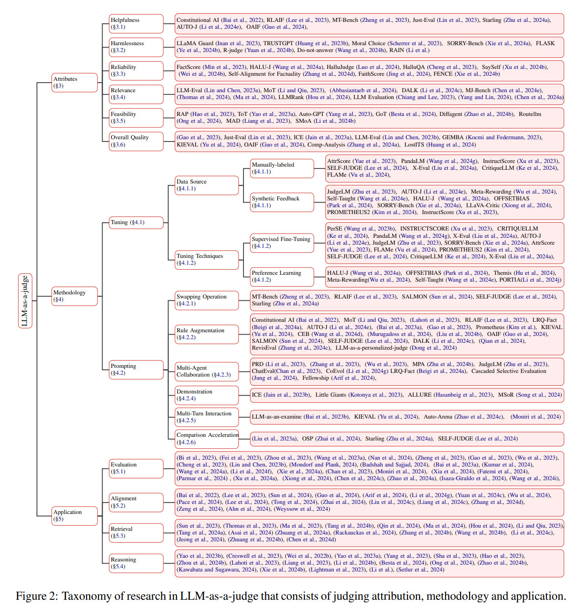

# Awesome-LLM-as-a-judge Survey

[](https://awesome.re)  


## Awesome-LLM-as-a-judge: A Survey
This repo include the papers discussed in our latest survey paper on Awesome-LLM-as-a-judge.

Our official websit: [Website](https://llm-as-a-judge.github.io/)

:book: Read the full paper here: [Paper Link](https://arxiv.org/abs/2411.16594)

## 🔔 News
- **`2025-4` We update our paper list and include papers of LLM-as-a-judge in March 2025!**
- **`2025-3` Want to learn more about risks and safety problems of using LLM-based annotation? Check out our new paper list on [AI supervision risk](https://github.com/David-Li0406/AI-Supervision-Risk)!**
- **`2025-3` We update our paper list and include papers of LLM-as-a-judge in February 2025, together with papers about thinking LLM as a judge!**
- **`2025-2` We update our paper list and include papers of LLM-as-a-judge in January 2025!**
- **`2025-2` Check our new paper about [preference leakage](https://arxiv.org/abs/2502.01534) in LLM-as-a-judge!**
- **`2024-12` Also check our paper list and survey on [LLM-based data annotation and synthesis](https://github.com/Zhen-Tan-dmml/LLM4Annotation)!**
- **`2024-12` We update our paper list and include papers of LLM-as-a-judge in December 2024!**
- **`2024-12` We update the slides, talk and report of our paper, check them in our [Website](https://llm-as-a-judge.github.io/)!**

## Reference
If our survey is useful for your research, please kindly cite our [paper](https://arxiv.org/abs/2411.16594):
```
@article{li2024llmasajudge,
  title   = {From Generation to Judgment: Opportunities and Challenges of LLM-as-a-judge},
  author  = {Dawei Li and Bohan Jiang and Liangjie Huang and Alimohammad Beigi and Chengshuai Zhao and Zhen Tan and Amrita Bhattacharjee and Yuxuan Jiang and Canyu Chen and Tianhao Wu and Kai Shu and Lu Cheng and Huan Liu},
  year    = {2024},
  journal = {arXiv preprint arXiv: 2411.16594}
}
```

## Overview of Awesome-LLM-as-a-judge:




## Table of Content (ToC)
- [Awesome-LLM-as-a-judge Survey](#awesome-llm-as-a-judge-survey)
  - [Awesome-LLM-as-a-judge: A Survey](#awesome-llm-as-a-judge-a-survey)
  - [🔔 News](#-news)
  - [Reference](#reference)
  - [Overview of Awesome-LLM-as-a-judge:](#overview-of-awesome-llm-as-a-judge)
  - [Table of Content (ToC)](#table-of-content-toc)
  - [Thinking LLM-as-a-judge](#thinking-llm-as-a-judge)
    - [Papers](#papers)
  - [Update](#update)
    - [03/2025](#032025)
    - [02/2025](#022025)
    - [01/2025](#012025)
    - [12/2024](#122024)
  - [1 Attributes](#1-attributes)
    - [1.1 Helpfulness](#11-helpfulness)
    - [1.2 Harmlessness](#12-harmlessness)
    - [1.3 Reliability](#13-reliability)
    - [1.4 Relevance](#14-relevance)
    - [1.5 Feasibility](#15-feasibility)
    - [1.6 Overall Quality](#16-overall-quality)
  - [2 Methodology](#2-methodology)
    - [2.1 Tuning](#21-tuning)
      - [Data Source](#data-source)
      - [Manually-labeled](#manually-labeled)
      - [Synthetic Feedback](#synthetic-feedback)
      - [Tuning Techiniques](#tuning-techiniques)
      - [Supervised Fine-Tuning](#supervised-fine-tuning)
      - [Preference Learning](#preference-learning)
    - [2.2 Prompting](#22-prompting)
      - [Swapping Operation](#swapping-operation)
      - [Rule Augmentation](#rule-augmentation)
      - [Multi-Agent Collaboration](#multi-agent-collaboration)
      - [Demonstration](#demonstration)
      - [Multi-Turn Interaction](#multi-turn-interaction)
      - [Comparison Acceleration](#comparison-acceleration)
  - [3 Application](#3-application)
    - [3.1 Evaluation](#31-evaluation)
    - [3.2 Alignment](#32-alignment)
    - [3.3 Retrieval](#33-retrieval)
    - [3.4 Reasoning](#34-reasoning)

## Thinking LLM-as-a-judge

### Papers

- **MCTS-Judge: Test-Time Scaling in LLM-as-a-Judge for Code Correctness Evaluation**. *ArXiv preprint* (2025) [[Paper]](https://arxiv.org/abs/2502.12468)
- **Learning to Plan & Reason for Evaluation with Thinking-LLM-as-a-Judge**. *ArXiv preprint* (2025) [[Paper]](https://arxiv.org/abs/2501.18099)
- **Verdict: A Library for Scaling Judge-Time Compute**. *ArXiv preprint* (2025) [[Paper]](https://arxiv.org/abs/2502.18018)
- **AgentRM: Enhancing Agent Generalization with Reward Modeling**. *ArXiv preprint* (2025) [[Paper]](https://arxiv.org/abs/2502.18407)


## Update

### 03/2025

- **BadJudge: Backdoor Vulnerabilities of LLM-as-a-Judge**. *ArXiv preprint* (2025) [[Paper]](https://arxiv.org/abs/2503.00596)
- **Evaluating Personalized Tool-Augmented LLMs from the Perspectives of Personalization and Proactivity**. *ArXiv preprint* (2025) [[Paper]](https://arxiv.org/abs/2503.00771)
- **Inference to the Best Explanation in Large Language Models**. *ArXiv preprint* (2024) [[Paper]](https://arxiv.org/abs/2402.10767)
- **Unmasking Implicit Bias: Evaluating Persona-Prompted LLM Responses in Power-Disparate Social Scenarios**. *ArXiv preprint* (2025) [[Paper]](https://arxiv.org/abs/2503.01532)
- **Evaluating LLMs' Assessment of Mixed-Context Hallucination Through the Lens of Summarization**. *ArXiv preprint* (2025) [[Paper]](https://arxiv.org/abs/2503.01670)
- **From Code to Courtroom: LLMs as the New Software Judges**. *ArXiv preprint* (2025) [[Paper]](https://arxiv.org/abs/2503.02246)
- **Improving LLM-as-a-Judge Inference with the Judgment Distribution**. *ArXiv preprint* (2025) [[Paper]](https://arxiv.org/abs/2503.03064)
- **Process-based Self-Rewarding Language Models**. *ArXiv preprint* (2025) [[Paper]](https://arxiv.org/abs/2503.03746)
- **TRACT: Regression-Aware Fine-tuning Meets Chain-of-Thought Reasoning for LLM-as-a-Judge**. *ArXiv preprint* (2025) [[Paper]](https://arxiv.org/abs/2503.04381)
- **Know Thy Judge: On the Robustness Meta-Evaluation of LLM Safety Judges**. *ArXiv preprint* (2025) [[Paper]](https://arxiv.org/abs/2503.04474)
- **RocketEval: Efficient Automated LLM Evaluation via Grading Checklist**. *ArXiv preprint* (2025) [[Paper]](https://arxiv.org/abs/2503.05142)
- **Extracting and Emulsifying Cultural Explanation to Improve Multilingual Capability of LLMs**. *ArXiv preprint* (2025) [[Paper]](https://arxiv.org/abs/2503.05846)
- **Dynamic Knowledge Integration for Evidence-Driven Counter-Argument Generation with Large Language Models**. *ArXiv preprint* (2025) [[Paper]](https://arxiv.org/abs/2503.05328)
- **An Empirical Study of Conformal Prediction in LLM with ASP Scaffolds for Robust Reasoning**. *ArXiv preprint* (2025) [[Paper]](https://arxiv.org/abs/2503.05439)
- **GRP: Goal-Reversed Prompting for Zero-Shot Evaluation with LLMs**. *ArXiv preprint* (2025) [[Paper]](https://arxiv.org/abs/2503.06139)
- **DAFE: LLM-Based Evaluation Through Dynamic Arbitration for Free-Form Question-Answering**. *ArXiv preprint* (2025) [[Paper]](https://arxiv.org/abs/2503.08542)
- **Validating LLM-as-a-Judge Systems in the Absence of Gold Labels**. *ArXiv preprint* (2025) [[Paper]](https://arxiv.org/abs/2503.05965)
- **Safer or Luckier? LLMs as Safety Evaluators Are Not Robust to Artifacts**. *ArXiv preprint* (2025) [[Paper]](https://arxiv.org/abs/2503.09347)
- **CheckEval: A reliable LLM-as-a-Judge framework for evaluating text generation using checklists**. *ArXiv preprint* (2024) [[Paper]](https://arxiv.org/abs/2403.18771)
- **CapArena: Benchmarking and Analyzing Detailed Image Captioning in the LLM Era**. *ArXiv preprint* (2025) [[Paper]](https://arxiv.org/abs/2503.12329)
- **GraphEval: A Lightweight Graph-Based LLM Framework for Idea Evaluation**. *ArXiv preprint* (2025) [[Paper]](https://arxiv.org/abs/2503.12600)
- **REPA: Russian Error Types Annotation for Evaluating Text Generation and Judgment Capabilities**. *ArXiv preprint* (2025) [[Paper]](https://arxiv.org/abs/2503.13102)
- **Why Do Multi-Agent LLM Systems Fail?**. *ArXiv preprint* (2025) [[Paper]](https://arxiv.org/abs/2503.13657)
- **Does Context Matter? ContextualJudgeBench for Evaluating LLM-based Judges in Contextual Settings**. *ArXiv preprint* (2025) [[Paper]](https://arxiv.org/abs/2503.15620)
- **Safety Aware Task Planning via Large Language Models in Robotics**. *ArXiv preprint* (2025) [[Paper]](https://arxiv.org/abs/2503.15707)
- **FutureGen: LLM-RAG Approach to Generate the Future Work of Scientific Article**. *ArXiv preprint* (2025) [[Paper]](https://arxiv.org/abs/2503.16561)
- **Summarization Metrics for Spanish and Basque: Do Automatic Scores and LLM-Judges Correlate with Humans?**. *ArXiv preprint* (2025) [[Paper]](https://arxiv.org/abs/2503.17039)
- **Improving Preference Extraction In LLMs By Identifying Latent Knowledge Through Classifying Probes**. *ArXiv preprint* (2025) [[Paper]](https://arxiv.org/abs/2503.17755)
- **GeoBenchX: Benchmarking LLMs for Multistep Geospatial Tasks**. *ArXiv preprint* (2025) [[Paper]](https://arxiv.org/abs/2503.18129)
- **Video SimpleQA: Towards Factuality Evaluation in Large Video Language Models**. *ArXiv preprint* (2025) [[Paper]](https://arxiv.org/abs/2503.18923)
- **Rankers, Judges, and Assistants: Towards Understanding the Interplay of LLMs in Information Retrieval Evaluation**. *ArXiv preprint* (2025) [[Paper]](https://arxiv.org/abs/2503.19092)
- **TN-Eval: Rubric and Evaluation Protocols for Measuring the Quality of Behavioral Therapy Notes**. *ArXiv preprint* (2025) [[Paper]](https://arxiv.org/abs/2503.20648)
- **OpenHuEval: Evaluating Large Language Model on Hungarian Specifics**. *ArXiv preprint* (2025) [[Paper]](https://arxiv.org/abs/2503.21500)
- **Prompt, Divide, and Conquer: Bypassing Large Language Model Safety Filters via Segmented and Distributed Prompt Processing**. *ArXiv preprint* (2025) [[Paper]](https://arxiv.org/abs/2503.21598)
- **Debate-Driven Multi-Agent LLMs for Phishing Email Detection**. *ArXiv preprint* (2025) [[Paper]](https://arxiv.org/abs/2503.22038)
- **Learning to Align Multi-Faceted Evaluation: A Unified and Robust Framework**. *ArXiv preprint* (2025) [[Paper]](https://arxiv.org/abs/2502.18874)
- **Adaptively evaluating models with task elicitation**. *ArXiv preprint* (2025) [[Paper]](https://arxiv.org/abs/2503.01986)
- **SEOE: A Scalable and Reliable Semantic Evaluation Framework for Open Domain Event Detection**. *ArXiv preprint* (2025) [[Paper]](https://arxiv.org/abs/2503.03303)
- **Exploring the Multilingual NLG Evaluation Abilities of LLM-Based Evaluators**. *ArXiv preprint* (2025) [[Paper]](https://arxiv.org/abs/2503.04360)
- **IFIR: A Comprehensive Benchmark for Evaluating Instruction-Following in Expert-Domain Information Retrieval**. *ArXiv preprint* (2025) [[Paper]](https://arxiv.org/abs/2503.04644)
- **Dynamic-KGQA: A Scalable Framework for Generating Adaptive Question Answering Datasets**. *ArXiv preprint* (2025) [[Paper]](https://arxiv.org/abs/2503.05049)
- **Human Implicit Preference-Based Policy Fine-tuning for Multi-Agent Reinforcement Learning in USV Swarm**. *ArXiv preprint* (2025) [[Paper]](https://arxiv.org/abs/2503.03796)
- **Quantifying the Reasoning Abilities of LLMs on Real-world Clinical Cases**. *ArXiv preprint* (2025) [[Paper]](https://arxiv.org/abs/2503.04691)
- **Exploring the Potential of Large Multimodal Models as Effective Alternatives for Pronunciation Assessment**. *ArXiv preprint* (2025) [[Paper]](https://arxiv.org/abs/2503.11229)
- **OpeNLGauge: An Explainable Metric for NLG Evaluation with Open-Weights LLMs**. *ArXiv preprint* (2025) [[Paper]](https://arxiv.org/abs/2503.11858)
- **NSF-SciFy: Mining the NSF Awards Database for Scientific Claims**. *ArXiv preprint* (2025) [[Paper]](https://arxiv.org/abs/2503.08600)
- **Argument Summarization and its Evaluation in the Era of Large Language Models**. *ArXiv preprint* (2025) [[Paper]](https://arxiv.org/abs/2503.00847)
- **Automated Non-Functional Requirements Generation in Software Engineering with Large Language Models: A Comparative Study**. *ArXiv preprint* (2025) [[Paper]](https://arxiv.org/abs/2503.15248)
- **AutoDrive-QA- Automated Generation of Multiple-Choice Questions for Autonomous Driving Datasets Using Large Vision-Language Models**. *ArXiv preprint* (2025) [[Paper]](https://arxiv.org/abs/2503.15778)
- **F¨´x¨¬: A Benchmark for Evaluating Language Models on Ancient Chinese Text Understanding and Generation**. *ArXiv preprint* (2025) [[Paper]](https://arxiv.org/abs/2503.15837)
- **VBench-2.0: Advancing Video Generation Benchmark Suite for Intrinsic Faithfulness**. *ArXiv preprint* (2025) [[Paper]](https://arxiv.org/abs/2503.21755)
- **Debiasing Multimodal Large Language Models via Noise-Aware Preference Optimization**. *ArXiv preprint* (2025) [[Paper]](https://arxiv.org/abs/2503.17928)
- **A Multi-Model Adaptation of Speculative Decoding for Classification**. *ArXiv preprint* (2025) [[Paper]](https://arxiv.org/abs/2503.18076)
- **Judge Anything: MLLM as a Judge Across Any Modality**. *ArXiv preprint* (2025) [[Paper]](https://arxiv.org/abs/2503.17489)
- **From Chaos to Order: The Atomic Reasoner Framework for Fine-grained Reasoning in Large Language Models**. *ArXiv preprint* (2025) [[Paper]](https://arxiv.org/abs/2503.15944)
- **Tuning LLMs by RAG Principles: Towards LLM-native Memory**. *ArXiv preprint* (2025) [[Paper]](https://arxiv.org/abs/2503.16071)
- **D3: Diversity, Difficulty, and Dependability-Aware Data Selection for Sample-Efficient LLM Instruction Tuning**. *ArXiv preprint* (2025) [[Paper]](https://arxiv.org/abs/2503.11441)
- **Towards reasoning era: A survey of long chain-of-thought for reasoning large language models**. *ArXiv preprint* (2025) [[Paper]](https://arxiv.org/abs/2503.09567)
- **DeepReview: Improving LLM-based Paper Review with Human-like Deep Thinking Process**. *ArXiv preprint* (2025) [[Paper]](https://arxiv.org/abs/2503.08569)
- **Exploring Industry Practices and Perspectives on AI Attribution in Co-Creative Use Cases**. *ArXiv preprint* (2025) [[Paper]](https://hai-gen.github.io/2025/papers/P2-HAI-GEN-2025%20He%20and%20Do.pdf)
- **Reasoning Through Execution: Unifying Process and Outcome Rewards for Code Generation**. *ArXiv preprint* (2025) [[Paper]](https://zhuohaoyu.github.io/assets/files/orps_icml_preprint.pdf)
- **Quantifying the Robustness of Retrieval-Augmented Language Models Against Spurious Features in Grounding Data**. *ArXiv preprint* (2025) [[Paper]](https://arxiv.org/abs/2503.05587)
- **No Free Labels: Limitations of LLM-as-a-Judge Without Human Grounding**. *ArXiv preprint* (2025) [[Paper]](https://arxiv.org/abs/2503.05061)
- **Graph-augmented reasoning: Evolving step-by-step knowledge graph retrieval for llm reasoning**. *ArXiv preprint* (2025) [[Paper]](https://arxiv.org/abs/2503.01642)


### 02/2025

- **RPGBENCH: Evaluating Large Language Models as Role-Playing Game Engines**. *ArXiv preprint* (2025) [[Paper]](https://arxiv.org/abs/2502.00595)
- **CollabLLM: From Passive Responders to Active Collaborators**. *ArXiv preprint* (2025) [[Paper]](https://arxiv.org/abs/2502.00640)
- **Towards Safer Chatbots: A Framework for Policy Compliance Evaluation of Custom GPTs**. *ArXiv preprint* (2025) [[Paper]](https://arxiv.org/abs/2502.01436)
- **Preference Leakage: A Contamination Problem in LLM-as-a-judge**. *ArXiv preprint* (2025) [[Paper]](https://arxiv.org/abs/2502.01534)
- **Tuning LLM Judge Design Decisions for 1/1000 of the Cost**. *ArXiv preprint* (2025) [[Paper]](https://arxiv.org/abs/2501.17178)
- **Reasoning-as-Logic-Units: Scaling Test-Time Reasoning in Large Language Models Through Logic Unit Alignment**. *ArXiv preprint* (2025) [[Paper]](https://arxiv.org/abs/2502.07803)
- **Training an LLM-as-a-Judge Model: Pipeline, Insights, and Practical Lessons**. *ArXiv preprint* (2025) [[Paper]](https://arxiv.org/abs/2502.02988)
- **SPRI: Aligning Large Language Models with Context-Situated Principles**. *ArXiv preprint* (2025) [[Paper]](https://arxiv.org/abs/2502.03397)
- **Great Models Think Alike and this Undermines AI Oversight**. *ArXiv preprint* (2025) [[Paper]](https://arxiv.org/abs/2502.04313)
- **Aligning Black-box Language Models with Human Judgments**. *ArXiv preprint* (2025) [[Paper]](https://arxiv.org/abs/2502.04997)
- **Bridging the Gap between Expert and Language Models: Concept-guided Chess Commentary Generation and Evaluation**. *ArXiv preprint* (2024) [[Paper]](https://arxiv.org/abs/2410.20811)
- **Quality Assurance for LLM-RAG Systems: Empirical Insights from Tourism Application Testing**. *ArXiv preprint* (2025) [[Paper]](https://arxiv.org/abs/2502.05782)
- **Can LLMs Replace Human Evaluators? An Empirical Study of LLM-as-a-Judge in Software Engineering**. *ArXiv preprint* (2025) [[Paper]](https://arxiv.org/abs/2502.06193)
- **Confidence Improves Self-Consistency in LLMs**. *ArXiv preprint* (2025) [[Paper]](https://arxiv.org/abs/2502.06233)
- **Expect the Unexpected: FailSafe Long Context QA for Finance**. *ArXiv preprint* (2025) [[Paper]](https://arxiv.org/abs/2502.06329)
- **GuideLLM: Exploring LLM-Guided Conversation with Applications in Autobiography Interviewing**. *ArXiv preprint* (2025) [[Paper]](https://arxiv.org/abs/2502.06494)
- **Towards Internet-Scale Training For Agents**. *ArXiv preprint* (2025) [[Paper]](https://arxiv.org/abs/2502.06776)
- **Language Model Council: Democratically Benchmarking Foundation Models on Highly Subjective Tasks**. *ArXiv preprint* (2024) [[Paper]](https://arxiv.org/abs/2406.08598)
- **Large Language Models and Synthetic Data for Monitoring Dataset Mentions in Research Papers**. *ArXiv preprint* (2025) [[Paper]](https://arxiv.org/abs/2502.10263)
- **VibeCheck: Discover and Quantify Qualitative Differences in Large Language Models**. *ArXiv preprint* (2024) [[Paper]](https://arxiv.org/abs/2410.12851)
- **An Empirical Analysis of Uncertainty in Large Language Model Evaluations**. *ArXiv preprint* (2025) [[Paper]](https://arxiv.org/abs/2502.10709)
- **NitiBench: A Comprehensive Studies of LLM Frameworks Capabilities for Thai Legal Question Answering**. *ArXiv preprint* (2025) [[Paper]](https://arxiv.org/abs/2502.10868)
- **Leveraging Uncertainty Estimation for Efficient LLM Routing**. *ArXiv preprint* (2025) [[Paper]](https://arxiv.org/abs/2502.11021)
- **Vendi-RAG: Adaptively Trading-Off Diversity And Quality Significantly Improves Retrieval Augmented Generation With LLMs**. *ArXiv preprint* (2025) [[Paper]](https://arxiv.org/abs/2502.11228)
- **Uncertainty-Aware Step-wise Verification with Generative Reward Models**. *ArXiv preprint* (2025) [[Paper]](https://arxiv.org/abs/2502.11250)
- **Towards Reasoning Ability of Small Language Models**. *ArXiv preprint* (2025) [[Paper]](https://arxiv.org/abs/2502.11569)
- **Improve LLM-as-a-Judge Ability as a General Ability**. *ArXiv preprint* (2025) [[Paper]](https://arxiv.org/abs/2502.11689)
- **Table-Critic: A Multi-Agent Framework for Collaborative Criticism and Refinement in Table Reasoning**. *ArXiv preprint* (2025) [[Paper]](https://arxiv.org/abs/2502.11799)
- **Can LLM Agents Maintain a Persona in Discourse?**. *ArXiv preprint* (2025) [[Paper]](https://arxiv.org/abs/2502.11843)
- **Sociodemographic Prompting is Not Yet an Effective Approach for Simulating Subjective Judgments with LLMs**. *ArXiv preprint* (2025) [[Paper]](https://arxiv.org/abs/2311.09730)
- **Idiosyncrasies in Large Language Models**. *ArXiv preprint* (2025) [[Paper]](https://arxiv.org/abs/2502.12150)
- **MCTS-Judge: Test-Time Scaling in LLM-as-a-Judge for Code Correctness Evaluation**. *ArXiv preprint* (2025) [[Paper]](https://arxiv.org/abs/2502.12468)
- **Truth Knows No Language: Evaluating Truthfulness Beyond English**. *ArXiv preprint* (2025) [[Paper]](https://arxiv.org/abs/2502.09387)
- **SimpleVQA: Multimodal Factuality Evaluation for Multimodal Large Language Models**. *ArXiv preprint* (2025) [[Paper]](https://arxiv.org/abs/2502.13059)
- **Theorem Prover as a Judge for Synthetic Data Generation**. *ArXiv preprint* (2025) [[Paper]](https://arxiv.org/abs/2502.13137)
- **Prompting a Weighting Mechanism into LLM-as-a-Judge in Two-Step: A Case Study**. *ArXiv preprint* (2025) [[Paper]](https://arxiv.org/abs/2502.13396)
- **PairJudge RM: Perform Best-of-N Sampling with Knockout Tournament**. *ArXiv preprint* (2025) [[Paper]](https://arxiv.org/abs/2501.13007)
- **RAG-Gym: Optimizing Reasoning and Search Agents with Process Supervision**. *ArXiv preprint* (2025) [[Paper]](https://arxiv.org/abs/2502.13957)
- **Investigating Non-Transitivity in LLM-as-a-Judge**. *ArXiv preprint* (2025) [[Paper]](https://arxiv.org/abs/2502.14074)
- **Selective Self-to-Supervised Fine-Tuning for Generalization in Large Language Models**. *ArXiv preprint* (2025) [[Paper]](https://arxiv.org/abs/2502.08130)
- **Judging It, Washing It: Scoring and Greenwashing Corporate Climate Disclosures using Large Language Models**. *ArXiv preprint* (2025) [[Paper]](https://arxiv.org/abs/2502.15094)
- **On Targeted Manipulation and Deception when Optimizing LLMs for User Feedback**. *ArXiv preprint* (2024) [[Paper]](https://arxiv.org/abs/2411.02306)
- **Towards Fully-Automated Materials Discovery via Large-Scale Synthesis Dataset and Expert-Level LLM-as-a-Judge**. *ArXiv preprint* (2025) [[Paper]](https://arxiv.org/abs/2502.16457)
- **On-Policy Self-Alignment with Fine-grained Knowledge Feedback for Hallucination Mitigation**. *ArXiv preprint* (2024) [[Paper]](https://arxiv.org/abs/2406.12221)
- **HealthQ: Unveiling Questioning Capabilities of LLM Chains in Healthcare Conversations**. *ArXiv preprint* (2024) [[Paper]](https://arxiv.org/abs/2409.19487)
- **Verdict: A Library for Scaling Judge-Time Compute**. *ArXiv preprint* (2025) [[Paper]](https://arxiv.org/abs/2502.18018)
- **MEMERAG: A Multilingual End-to-End Meta-Evaluation Benchmark for Retrieval Augmented Generation**. *ArXiv preprint* (2025) [[Paper]](https://arxiv.org/abs/2502.17163)
- **Debt Collection Negotiations with Large Language Models: An Evaluation System and Optimizing Decision Making with Multi-Agent**. *ArXiv preprint* (2025) [[Paper]](https://arxiv.org/abs/2502.18228)
- **AgentRM: Enhancing Agent Generalization with Reward Modeling**. *ArXiv preprint* (2025) [[Paper]](https://arxiv.org/abs/2502.18407)
- **Better Instruction-Following Through Minimum Bayes Risk**. *ArXiv preprint* (2024) [[Paper]](https://arxiv.org/abs/2410.02902)
- **Judge as A Judge: Improving the Evaluation of Retrieval-Augmented Generation through the Judge-Consistency of Large Language Models**. *ArXiv preprint* (2025) [[Paper]](https://arxiv.org/abs/2502.18817)
- **Can Large Language Models Outperform Non-Experts in Poetry Evaluation? A Comparative Study Using the Consensual Assessment Technique**. *ArXiv preprint* (2025) [[Paper]](https://arxiv.org/abs/2502.19064)
- **Bi'an: A Bilingual Benchmark and Model for Hallucination Detection in Retrieval-Augmented Generation**. *ArXiv preprint* (2025) [[Paper]](https://arxiv.org/abs/2502.19209)
- **Learning to Generate Unit Tests for Automated Debugging**. *ArXiv preprint* (2025) [[Paper]](https://arxiv.org/abs/2502.01619)
- **Stay Focused: Problem Drift in Multi-Agent Debate**. *ArXiv preprint* (2025) [[Paper]](https://arxiv.org/abs/2502.19559)
- **AIR: Complex Instruction Generation via Automatic Iterative Refinement**. *ArXiv preprint* (2025) [[Paper]](https://arxiv.org/abs/2502.17787)
- **LLM Evaluation Based on Aerospace Manufacturing Expertise: Automated Generation and Multi-Model Question Answering**. *ArXiv preprint* (2025) [[Paper]](https://arxiv.org/abs/2501.17183)
- **Defense Against the Dark Prompts: Mitigating Best-of-N Jailbreaking with Prompt Evaluation**. *ArXiv preprint* (2025) [[Paper]](https://arxiv.org/abs/2502.00580)
- **Using LLM-Based Approaches to Enhance and Automate Topic Labeling**. *ArXiv preprint* (2025) [[Paper]](https://arxiv.org/abs/2502.18469)
- **A Systematic Approach for Assessing Large Language Models' Test Case Generation Capability**. *ArXiv preprint* (2025) [[Paper]](https://arxiv.org/abs/2502.02866)
- **Decoding AI Judgment: How LLMs Assess News Credibility and Bias**. *ArXiv preprint* (2025) [[Paper]](https://arxiv.org/abs/2502.04426)
- **Unifying AI Tutor Evaluation: An Evaluation Taxonomy for Pedagogical Ability Assessment of LLM-Powered AI Tutors**. *ArXiv preprint* (2024) [[Paper]](https://arxiv.org/abs/2412.09416)
- **Investigating the Shortcomings of LLMs in Step-by-Step Legal Reasoning**. *ArXiv preprint* (2025) [[Paper]](https://arxiv.org/abs/2502.05675)
- **Revisiting Benchmark and Assessment: An Agent-based Exploratory Dynamic Evaluation Framework for LLMs**. *ArXiv preprint* (2024) [[Paper]](https://arxiv.org/abs/2410.11507)
- **Bridging the Evaluation Gap: Leveraging Large Language Models for Topic Model Evaluation**. *ArXiv preprint* (2025) [[Paper]](https://arxiv.org/abs/2502.07352)
- **On Iterative Evaluation and Enhancement of Code Quality Using GPT-4o**. *ArXiv preprint* (2025) [[Paper]](https://arxiv.org/abs/2502.07399)
- **Copilot Arena: A Platform for Code LLM Evaluation in the Wild**. *ArXiv preprint* (2025) [[Paper]](https://arxiv.org/abs/2502.09328)
- **Faithful, Unfaithful or Ambiguous? Multi-Agent Debate with Initial Stance for Summary Evaluation**. *ArXiv preprint* (2025) [[Paper]](https://arxiv.org/abs/2502.08514)
- **LLMs can Perform Multi-Dimensional Analytic Writing Assessments: A Case Study of L2 Graduate-Level Academic English Writing**. *ArXiv preprint* (2025) [[Paper]](https://arxiv.org/abs/2502.11368)
- **A Dual-Perspective NLG Meta-Evaluation Framework with Automatic Benchmark and Better Interpretability**. *ArXiv preprint* (2025) [[Paper]](https://arxiv.org/abs/2502.12052)
- **MT-RAIG: Novel Benchmark and Evaluation Framework for Retrieval-Augmented Insight Generation over Multiple Tables**. *ArXiv preprint* (2025) [[Paper]](https://arxiv.org/abs/2502.11735)
- **HPSS: Heuristic Prompting Strategy Search for LLM Evaluators**. *ArXiv preprint* (2025) [[Paper]](https://arxiv.org/abs/2502.13031)
- **Rate, Explain and Cite (REC): Enhanced Explanation and Attribution in Automatic Evaluation by Large Language Models**. *ArXiv preprint* (2024) [[Paper]](https://arxiv.org/abs/2411.02448)
- **Assessing the Reasoning Capabilities of LLMs in the context of Evidence-based Claim Verification**. *ArXiv preprint* (2024) [[Paper]](https://arxiv.org/abs/2402.10735)
- **StructFlowBench: A Structured Flow Benchmark for Multi-turn Instruction Following**. *ArXiv preprint* (2025) [[Paper]](https://arxiv.org/abs/2502.14494)
- **How to Get Your LLM to Generate Challenging Problems for Evaluation**. *ArXiv preprint* (2025) [[Paper]](https://arxiv.org/abs/2502.14678)
- **Training Turn-by-Turn Verifiers for Dialogue Tutoring Agents: The Curious Case of LLMs as Your Coding Tutors**. *ArXiv preprint* (2025) [[Paper]](https://arxiv.org/abs/2502.13311)
- **CVE-LLM : Ontology-Assisted Automatic Vulnerability Evaluation Using Large Language Models**. *ArXiv preprint* (2025) [[Paper]](https://arxiv.org/abs/2502.15932)
- **ReviewEval: An Evaluation Framework for AI-Generated Reviews**. *ArXiv preprint* (2025) [[Paper]](https://arxiv.org/abs/2502.11736)
- **IPO: Your Language Model is Secretly a Preference Classifier**. *ArXiv preprint* (2025) [[Paper]](https://arxiv.org/abs/2502.16182)
- **Recent Advances in Large Langauge Model Benchmarks against Data Contamination: From Static to Dynamic Evaluation**. *ArXiv preprint* (2025) [[Paper]](https://arxiv.org/abs/2502.17521)
- **GuidedBench: Equipping Jailbreak Evaluation with Guidelines**. *ArXiv preprint* (2025) [[Paper]](https://arxiv.org/abs/2502.16903)
- **A Meta-Evaluation of Style and Attribute Transfer Metrics**. *ArXiv preprint* (2025) [[Paper]](https://arxiv.org/abs/2502.15022)
- **How Good Are LLMs for Literary Translation, Really? Literary Translation Evaluation with Humans and LLMs**. *ArXiv preprint* (2024) [[Paper]](https://arxiv.org/abs/2410.18697)
- **RefuteBench 2.0 -- Agentic Benchmark for Dynamic Evaluation of LLM Responses to Refutation Instruction**. *ArXiv preprint* (2025) [[Paper]](https://arxiv.org/abs/2502.18308)
- **LongEval: A Comprehensive Analysis of Long-Text Generation Through a Plan-based Paradigm**. *ArXiv preprint* (2025) [[Paper]](https://arxiv.org/abs/2502.19103)
- **Factual consistency evaluation of summarization in the Era of large language models**. *ArXiv preprint* (2024) [[Paper]](https://arxiv.org/abs/2402.13758)
- **CopyJudge: Automated Copyright Infringement Identification and Mitigation in Text-to-Image Diffusion Models**. *ArXiv preprint* (2025) [[Paper]](https://arxiv.org/abs/2502.15278)


### 01/2025

- **CoReQA: Uncovering Potentials of Language Models in Code Repository Question Answering**. *ArXiv preprint* (2025) [[Paper]](https://arxiv.org/abs/2501.03447)
- **MTRAG: A Multi-Turn Conversational Benchmark for Evaluating Retrieval-Augmented Generation Systems**. *ArXiv preprint* (2025) [[Paper]](https://arxiv.org/abs/2501.03468)
- **SMIR: Efficient Synthetic Data Pipeline To Improve Multi-Image Reasoning**. *ArXiv preprint* (2025) [[Paper]](https://arxiv.org/abs/2501.03675)
- **EpiCoder: Encompassing Diversity and Complexity in Code Generation**. *ArXiv preprint* (2025) [[Paper]](https://arxiv.org/abs/2501.04694)
- **Leveraging Large Language Models for Zero-shot Lay Summarisation in Biomedicine and Beyond**. *ArXiv preprint* (2025) [[Paper]](https://arxiv.org/abs/2501.05224)
- **Measuring the Robustness of Reference-Free Dialogue Evaluation Systems**. *ArXiv preprint* (2025) [[Paper]](https://arxiv.org/abs/2501.06728)
- **The Lessons of Developing Process Reward Models in Mathematical Reasoning**. *ArXiv preprint* (2025) [[Paper]](https://arxiv.org/abs/2501.07301)
- **U-MATH: A University-Level Benchmark for Evaluating Mathematical Skills in LLMs**. *ArXiv preprint* (2024) [[Paper]](https://arxiv.org/abs/2412.03205)
- **Agent-as-Judge for Factual Summarization of Long Narratives**. *ArXiv preprint* (2025) [[Paper]](https://arxiv.org/abs/2501.09993)
- **The Alternative Annotator Test for LLM-as-a-Judge: How to Statistically Justify Replacing Human Annotators with LLMs**. *ArXiv preprint* (2025) [[Paper]](https://arxiv.org/abs/2501.10970)
- **The Dual-use Dilemma in LLMs: Do Empowering Ethical Capacities Make a Degraded Utility?**. *ArXiv preprint* (2025) [[Paper]](https://arxiv.org/abs/2501.13952)
- **Potential and Perils of Large Language Models as Judges of Unstructured Textual Data**. *ArXiv preprint* (2025) [[Paper]](https://arxiv.org/abs/2501.08167)
- **Early evidence of how LLMs outperform traditional systems on OCR/HTR tasks for historical records**. *ArXiv preprint* (2025) [[Paper]](https://arxiv.org/abs/2501.11623)
- **Towards Interpretable Radiology Report Generation via Concept Bottlenecks using a Multi-Agentic RAG**. *ArXiv preprint* (2024) [[Paper]](https://arxiv.org/abs/2412.16086)
- **Refining Input Guardrails: Enhancing LLM-as-a-Judge Efficiency Through Chain-of-Thought Fine-Tuning and Alignment**. *ArXiv preprint* (2025) [[Paper]](https://arxiv.org/abs/2501.13080)
- **SedarEval: Automated Evaluation using Self-Adaptive Rubrics**. *ArXiv preprint* (2025) [[Paper]](https://arxiv.org/abs/2501.15595)
- **Beyond correlation: The Impact of Human Uncertainty in Measuring the Effectiveness of Automatic Evaluation and LLM-as-a-Judge**. *ArXiv preprint* (2024) [[Paper]](https://arxiv.org/abs/2410.03775)
- **VeriFact: Verifying Facts in LLM-Generated Clinical Text with Electronic Health Records**. *ArXiv preprint* (2025) [[Paper]](https://arxiv.org/abs/2501.16672)
- **MultiChallenge: A Realistic Multi-Turn Conversation Evaluation Benchmark Challenging to Frontier LLMs**. *ArXiv preprint* (2025) [[Paper]](https://arxiv.org/abs/2501.17399)
- **LLMs can be Fooled into Labelling a Document as Relevant (best cafиж near me; this paper is perfectly relevant)**. *ArXiv preprint* (2025) [[Paper]](https://arxiv.org/abs/2501.17969)
- **Learning to Plan & Reason for Evaluation with Thinking-LLM-as-a-Judge**. *ArXiv preprint* (2025) [[Paper]](https://arxiv.org/abs/2501.18099)
- **GroUSE: A Benchmark to Evaluate Evaluators in Grounded Question Answering**. *ArXiv preprint* (2024) [[Paper]](https://arxiv.org/abs/2409.06595)
- **Illusions of Relevance: Using Content Injection Attacks to Deceive Retrievers, Rerankers, and LLM Judges**. *ArXiv preprint* (2025) [[Paper]](https://arxiv.org/abs/2501.18536)
- **Judge Decoding: Faster Speculative Sampling Requires Going Beyond Model Alignment**. *ArXiv preprint* (2025) [[Paper]](https://arxiv.org/abs/2501.19309)
- **Distilling Desired Comments for Enhanced Code Review with Large Language Models**. *ArXiv preprint* (2024) [[Paper]](https://arxiv.org/abs/2412.20340)
- **LLMPC: Large Language Model Predictive Control**. *ArXiv preprint* (2025) [[Paper]](https://arxiv.org/abs/2501.02486)
- **Can LLMs Design Good Questions Based on Context?**. *ArXiv preprint* (2025) [[Paper]](https://arxiv.org/abs/2501.03491)
- **CodEv: An Automated Grading Framework Leveraging Large Language Models for Consistent and Constructive Feedback**. *ArXiv preprint* (2025) [[Paper]](https://arxiv.org/abs/2501.10421)
- **Can Many-Shot In-Context Learning Help LLMs as Evaluators? A Preliminary Empirical Study**. *ArXiv preprint* (2024) [[Paper]](https://arxiv.org/abs/2406.11629)
- **Hierarchical Divide-and-Conquer for Fine-Grained Alignment in LLM-Based Medical Evaluation**. *ArXiv preprint* (2025) [[Paper]](https://arxiv.org/abs/2501.06741)
- **LLM Reading Tea Leaves: Automatically Evaluating Topic Models with Large Language Models**. *ArXiv preprint* (2024) [[Paper]](https://arxiv.org/abs/2406.09008)
- **Evaluating Mathematical Reasoning Beyond Accuracy**. *ArXiv preprint* (2024) [[Paper]](https://arxiv.org/abs/2404.05692)
- **PASS: Presentation Automation for Slide Generation and Speech**. *ArXiv preprint* (2025) [[Paper]](https://arxiv.org/abs/2501.06497)
- **The Veln(ia)s is in the Details: Evaluating LLM Judgment on Latvian and Lithuanian Short Answer Matching**. *ArXiv preprint* (2025) [[Paper]](https://arxiv.org/abs/2501.09164)
- **Aligning with Human Judgement: The Role of Pairwise Preference in Large Language Model Evaluators**. *ArXiv preprint* (2024) [[Paper]](https://arxiv.org/abs/2403.16950)
- **Exploring the Reliability of Large Language Models as Customized Evaluators for Diverse NLP Tasks**. *ArXiv preprint* (2025) [[Paper]](https://arxiv.org/abs/2310.19740)
- **Synthetic Data Can Mislead Evaluations: Membership Inference as Machine Text Detection**. *ArXiv preprint* (2025) [[Paper]](https://arxiv.org/abs/2501.11786)
- **Exploring GPT's Ability as a Judge in Music Understanding**. *ArXiv preprint* (2025) [[Paper]](https://arxiv.org/abs/2501.13261)
- **AdEval: Alignment-based Dynamic Evaluation to Mitigate Data Contamination in Large Language Models**. *ArXiv preprint* (2025) [[Paper]](https://arxiv.org/abs/2501.13983)
- **Recording for Eyes, Not Echoing to Ears: Contextualized Spoken-to-Written Conversion of ASR Transcripts**. *ArXiv preprint* (2024) [[Paper]](https://arxiv.org/abs/2408.09688)
- **ExPerT: Effective and Explainable Evaluation of Personalized Long-Form Text Generation**. *ArXiv preprint* (2025) [[Paper]](https://arxiv.org/abs/2501.14956)
- **Do LLMs Have Visualization Literacy? An Evaluation on Modified Visualizations to Test Generalization in Data Interpretation**. *ArXiv preprint* (2025) [[Paper]](https://arxiv.org/abs/2501.16277)
- **On A Scale From 1 to 5: Quantifying Hallucination in Faithfulness Evaluation**. *ArXiv preprint* (2024) [[Paper]](https://arxiv.org/abs/2410.12222)
- **Audio Large Language Models Can Be Descriptive Speech Quality Evaluators**. *ArXiv preprint* (2025) [[Paper]](https://arxiv.org/abs/2501.17202)
- **Large Language Model Critics for Execution-Free Evaluation of Code Changes**. *ArXiv preprint* (2025) [[Paper]](https://arxiv.org/abs/2501.16655)
- **CSEval: Towards Automated, Multi-Dimensional, and Reference-Free Counterspeech Evaluation using Auto-Calibrated LLMs**. *ArXiv preprint* (2025) [[Paper]](https://arxiv.org/abs/2501.17581)
- **Generative Information Retrieval Evaluation**. *ArXiv preprint* (2024) [[Paper]](https://arxiv.org/abs/2404.08137)
- **Normative Evaluation of Large Language Models with Everyday Moral Dilemmas**. *ArXiv preprint* (2025) [[Paper]](https://arxiv.org/abs/2501.18081)
- **LLM Cyber Evaluations Don't Capture Real-World Risk**. *ArXiv preprint* (2025) [[Paper]](https://arxiv.org/abs/2502.00072)
- **GPT-4o as the Gold Standard: A Scalable and General Purpose Approach to Filter Language Model Pretraining Data**. *ArXiv preprint* (2024) [[Paper]](https://arxiv.org/abs/2410.02755)
- **Large Language Models' Accuracy in Emulating Human Experts' Evaluation of Public Sentiments about Heated Tobacco Products on Social Media**. *ArXiv preprint* (2025) [[Paper]](https://arxiv.org/abs/2502.01658)
- **E2CL: Exploration-based Error Correction Learning for Embodied Agents**. *ArXiv preprint* (2024) [[Paper]](https://arxiv.org/abs/2409.03256)
- **Aligning with Human Judgement: The Role of Pairwise Preference in Large Language Model Evaluators**. *ArXiv preprint* (2024) [[Paper]](https://arxiv.org/abs/2403.16950)
- **Fairer Preferences Elicit Improved Human-Aligned Large Language Model Judgments**. *ArXiv preprint* (2024) [[Paper]](https://arxiv.org/abs/2406.11370)
- **Aligning with Logic: Measuring, Evaluating and Improving Logical Consistency in Large Language Models**. *ArXiv preprint* (2024) [[Paper]](https://arxiv.org/abs/2410.02205)
- **Visual Large Language Models for Generalized and Specialized Applications**. *ArXiv preprint* (2025) [[Paper]](https://arxiv.org/abs/2501.02765)
- **TalBot: An LLM-based robot assisted language learning system for children with language vulnerabilities**. *ArXiv preprint* (2025) [[Paper]](https://research.abo.fi/ws/portalfiles/portal/65441119/preprint.pdf)
- **TiEBe: A Benchmark for Assessing the Current Knowledge of Large Language Models**. *ArXiv preprint* (2025) [[Paper]](https://arxiv.org/abs/2501.07482)
- **Solving the Unsolvable: Translating Case Law in Hong Kong**. *ArXiv preprint* (2025) [[Paper]](https://arxiv.org/abs/2501.09444)
- **Atla Selene Mini: A General Purpose Evaluation Model**. *ArXiv preprint* (2025) [[Paper]](https://arxiv.org/abs/2501.17195)
- **M-MAD: Multidimensional Multi-Agent Debate Framework for Fine-grained Machine Translation Evaluation**. *ArXiv preprint* (2024) [[Paper]](https://arxiv.org/abs/2412.20127)


### 12/2024

- **Engineering AI Judge Systems** Jiahuei Lin (Justina), Dayi Lin, Sky Zhang, Ahmed E. Hassan. *ArXiv preprint* (2024) [[Paper]](https://arxiv.org/pdf/2411.17793)

- **LMUnit: Fine-grained Evaluation with Natural Language Unit Tests** Jon Saad-Falcon, Rajan Vivek, William Berrios, Nandita Shankar Naik, Matija Franklin, Bertie Vidgen, Amanpreet Singh, Douwe Kiela, Shikib Mehri. *ArXiv preprint* (2024) [[Paper]](https://arxiv.org/pdf/2412.13091)

- **ACE-M3: Automatic Capability Evaluator for Multimodal Medical Models** Xiechi Zhang, Shunfan Zheng, Linlin Wang, Gerard de Melo, Zhu Cao, Xiaoling Wang, Liang He. *ArXiv preprint* (2024) [[Paper]](https://arxiv.org/pdf/2412.11453)

- **IQA-EVAL: Automatic Evaluation of Human-Model Interactive Question Answering** Ruosen Li, Ruochen Li, Barry Wang, Xinya Du. *ArXiv preprint* (2024) [[Paper]](https://arxiv.org/pdf/2408.13545)

- **StrategyLLM: Large Language Models as Strategy Generators, Executors, Optimizers, and Evaluators for Problem Solving** Chang Gao, Haiyun Jiang, Deng Cai, Shuming Shi, Wai Lam. *ArXiv preprint* (2024) [[Paper]](https://arxiv.org/pdf/2311.08803)

- **ALI-Agent: Assessing LLMs' Alignment with Human Values via Agent-based Evaluation** Jingnan Zheng, Han Wang, An Zhang, Tai D. Nguyen, Jun Sun, Tat-Seng Chua. *ArXiv preprint* (2024) [[Paper]](https://arxiv.org/pdf/2405.14125)

- **On scalable oversight with weak LLMs judging strong LLMs** Zachary Kenton, Noah Y. Siegel, János Kramár, Jonah Brown-Cohen, Samuel Albanie, Jannis Bulian, Rishabh Agarwal, David Lindner, Yunhao Tang, Noah D. Goodman, Rohin Shah. *ArXiv preprint* (2024) [[Paper]](https://arxiv.org/pdf/2407.04622)

- **Easy-to-Hard Generalization: Scalable Alignment Beyond Human Supervision** Zhiqing Sun, Longhui Yu, Yikang Shen, Weiyang Liu, Yiming Yang, Sean Welleck, Chuang Gan. *ArXiv preprint* (2024) [[Paper]](https://arxiv.org/pdf/2403.09472)

- **CriticEval: Evaluating Large Language Model as Critic** Tian Lan, Wenwei Zhang, Chen Xu, Heyan Huang, Dahua Lin, Kai Chen, Xian-ling Mao. *ArXiv preprint* (2024) [[Paper]](https://arxiv.org/pdf/2402.13764)

- **Adaptive Image Quality Assessment via Teaching Large Multimodal Model to Compare** Hanwei Zhu, Haoning Wu, Yixuan Li, Zicheng Zhang, Baoliang Chen, Lingyu Zhu, Yuming Fang, Guangtao Zhai, Weisi Lin, Shiqi Wang. *ArXiv preprint* (2024) [[Paper]](https://arxiv.org/pdf/2405.19298)

- **Beyond Guilt: Legal Judgment Prediction with Trichotomous Reasoning** Kepu Zhang, Haoyue Yang, Xu Tang, Weijie Yu, Jun Xu. *ArXiv preprint* (2024) [[Paper]](https://arxiv.org/pdf/2412.14588)

- **Let your LLM generate a few tokens and you will reduce the need for retrieval** Hervé Déjean. *ArXiv preprint* (2024) [[Paper]](https://arxiv.org/pdf/2412.11536)

- **Can You Trust LLM Judgments? Reliability of LLM-as-a-Judge** Kayla Schroeder, Zach Wood-Doughty. *ArXiv preprint* (2024) [[Paper]](https://arxiv.org/pdf/2412.12509)

- **Using LLM-Generated Draft Replies to Support Human Experts in Responding to Stakeholder Inquiries in Maritime Industry: A Real-World Case Study of Industrial AI** Tita Alissa Bach, Aleksandar Babic, Narae Park, Tor Sporsem, Rasmus Ulfsnes, Henrik Smith-Meyer, Torkel Skeie. *ArXiv preprint* (2024) [[Paper]](https://arxiv.org/pdf/2412.12732)

- **An Exploratory Study of ML Sketches and Visual Code Assistants** Luís F. Gomes, Vincent J. Hellendoorn, Jonathan Aldrich, Rui Abreu. *ArXiv preprint* (2024) [[Paper]](https://arxiv.org/pdf/2412.13386)

- **Steering Large Language Models to Evaluate and Amplify Creativity** Matthew Lyle Olson, Neale Ratzlaff, Musashi Hinck, Shao-yen Tseng, Vasudev Lal. *ArXiv preprint* (2024) [[Paper]](https://arxiv.org/pdf/2412.06060)

- **Optimizing Alignment with Less: Leveraging Data Augmentation for Personalized Evaluation** Javad Seraj, Mohammad Mahdi Mohajeri, Mohammad Javad Dousti, Majid Nili Ahmadabadi. *ArXiv preprint* (2024) [[Paper]](https://arxiv.org/pdf/2412.07429)

- **Exploring Large Language Models on Cross-Cultural Values in Connection with Training Methodology** Minsang Kim, Seungjun Baek. *ArXiv preprint* (2024) [[Paper]](https://arxiv.org/pdf/2412.08846)

- **GLIDER: Grading LLM Interactions and Decisions using Explainable Ranking** Darshan Deshpande, Selvan Sunitha Ravi, Sky CH-Wang, Bartosz Mielczarek, Anand Kannappan, Rebecca Qian. *ArXiv preprint* (2024) [[Paper]](https://arxiv.org/pdf/2412.14140)

- **CharacterBench: Benchmarking Character Customization of Large Language Models** Jinfeng Zhou, Yongkang Huang, Bosi Wen, Guanqun Bi, Yuxuan Chen, Pei Ke, Zhuang Chen, Xiyao Xiao, Libiao Peng, Kuntian Tang, Rongsheng Zhang, Le Zhang, Tangjie Lv, Zhipeng Hu, Hongning Wang, Minlie Huang. *ArXiv preprint* (2024) [[Paper]](https://arxiv.org/pdf/2412.11912)

- **LongBench v2: Towards Deeper Understanding and Reasoning on Realistic Long-context Multitasks** Yushi Bai, Shangqing Tu, Jiajie Zhang, Hao Peng, Xiaozhi Wang, Xin Lv, Shulin Cao, Jiazheng Xu, Lei Hou, Yuxiao Dong, Jie Tang, Juanzi Li. *ArXiv preprint* (2024) [[Paper]](https://arxiv.org/pdf/2412.15204)

- **JudgeBlender: Ensembling Judgments for Automatic Relevance Assessment** Hossein A. Rahmani, Emine Yilmaz, Nick Craswell, Bhaskar Mitra. *ArXiv preprint* (2024) [[Paper]](https://arxiv.org/pdf/2412.13268)

- **Assessing the Impact of Conspiracy Theories Using Large Language Models** Bohan Jiang, Dawei Li, Zhen Tan, Xinyi Zhou, Ashwin Rao, Kristina Lerman, H. Russell Bernard, Huan Liu. *ArXiv preprint* (2024) [[Paper]](https://arxiv.org/pdf/2412.07019)

- **Outcome-Refining Process Supervision for Code Generation** Zhuohao Yu, Weizheng Gu, Yidong Wang, Zhengran Zeng, Jindong Wang, Wei Ye, Shikun Zhang. *ArXiv preprint* (2024) [[Paper]](https://arxiv.org/pdf/2412.15118)

- **RAG-RewardBench: Benchmarking Reward Models in Retrieval Augmented Generation for Preference Alignment** Zhuoran Jin, Hongbang Yuan, Tianyi Men, Pengfei Cao, Yubo Chen, Kang Liu, Jun Zhao. *ArXiv preprint* (2024) [[Paper]](https://arxiv.org/pdf/2412.13746)

- **JuStRank: Benchmarking LLM Judges for System Ranking** Ariel Gera, Odellia Boni, Yotam Perlitz, Roy Bar-Haim, Lilach Eden, Asaf Yehudai. *ArXiv preprint* (2024) [[Paper]](https://arxiv.org/pdf/2412.09569)

- **INDICT: Code Generation with Internal Dialogues of Critiques for Both Security and Helpfulness** Hung Le, Yingbo Zhou, Caiming Xiong, Silvio Savarese, Doyen Sahoo. *ArXiv preprint* (2024) [[Paper]](https://arxiv.org/pdf/2407.02518)

- **LLM Evaluators Recognize and Favor Their Own Generations** Arjun Panickssery, Samuel R. Bowman, Shi Feng. *ArXiv preprint* (2024) [[Paper]](https://arxiv.org/pdf/2404.13076)

- **Training Language Models to Critique With Multi-agent Feedback** Tian Lan, Wenwei Zhang, Chengqi Lyu, Shuaibin Li, Chen Xu, Heyan Huang, Dahua Lin, Xian-Ling Mao, Kai Chen. *ArXiv preprint* (2024) [[Paper]](https://arxiv.org/pdf/2410.15287)

- **Beyond Exact Match: Semantically Reassessing Event Extraction by Large Language Models** Yi-Fan Lu, Xian-Ling Mao, Tian Lan, Chen Xu, Heyan Huang. *ArXiv preprint* (2024) [[Paper]](https://arxiv.org/pdf/2410.09418)

- **Automatic Evaluation for Text-to-image Generation: Task-decomposed Framework, Distilled Training, and Meta-evaluation Benchmark** Rong-Cheng Tu, Zi-Ao Ma, Tian Lan, Yuehao Zhao, Heyan Huang, Xian-Ling Mao. *ArXiv preprint* (2024) [[Paper]](https://arxiv.org/pdf/2411.15488)

- **Multi-modal Retrieval Augmented Multi-modal Generation: A Benchmark, Evaluate Metrics and Strong Baselines** Zi-Ao Ma, Tian Lan, Rong-Cheng Tu, Yong Hu, Heyan Huang, Xian-Ling Mao. *ArXiv preprint* (2024) [[Paper]](https://arxiv.org/pdf/2411.16365)

- **LLM-AS-AN-INTERVIEWER: Beyond Static Testing Through Dynamic LLM Evaluation** Eunsu Kim, Juyoung Suk, Seungone Kim, Niklas Muennighoff, Dongkwan Kim, Alice Oh. *ArXiv preprint* (2024) [[Paper]](https://arxiv.org/pdf/2412.10424)

- **MAG-V: A Multi-Agent Framework for Synthetic Data Generation and Verification** Saptarshi Sengupta, Kristal Curtis, Akshay Mallipeddi, Abhinav Mathur, Joseph Ross, Liang Gou. *ArXiv preprint* (2024) [[Paper]](https://arxiv.org/pdf/2412.04494)

- **Law of the Weakest Link: Cross Capabilities of Large Language Models** Ming Zhong, Aston Zhang, Xuewei Wang, Rui Hou, Wenhan Xiong, Chenguang Zhu, Zhengxing Chen, Liang Tan, Chloe Bi, Mike Lewis, Sravya Popuri, Sharan Narang, Melanie Kambadur, Dhruv Mahajan, Sergey Edunov, Jiawei Han, Laurens van der Maaten. *ArXiv preprint* (2024) [[Paper]](https://arxiv.org/pdf/2409.19951)

- **MCQG-SRefine: Multiple Choice Question Generation and Evaluation with Iterative Self-Critique, Correction, and Comparison Feedback** Zonghai Yao, Aditya Parashar, Huixue Zhou, Won Seok Jang, Feiyun Ouyang, Zhichao Yang, Hong Yu. *ArXiv preprint* (2024) [[Paper]](https://arxiv.org/pdf/2410.13191)

- **ALMA: Alignment with Minimal Annotation** Michihiro Yasunaga, Leonid Shamis, Chunting Zhou, Andrew Cohen, Jason Weston, Luke Zettlemoyer, Marjan Ghazvininejad. *ArXiv preprint* (2024) [[Paper]](https://arxiv.org/pdf/2412.04305)

- **ConQRet: Benchmarking Fine-Grained Evaluation of Retrieval Augmented Argumentation with LLM Judges** Kaustubh D. Dhole, Kai Shu, Eugene Agichtein. *ArXiv preprint* (2024) [[Paper]](https://arxiv.org/pdf/2412.05206)

- **Evaluating and Aligning CodeLLMs on Human Preference** Jian Yang, Jiaxi Yang, Ke Jin, Yibo Miao, Lei Zhang, Liqun Yang, Zeyu Cui, Yichang Zhang, Binyuan Hui, Junyang Lin. *ArXiv preprint* (2024) [[Paper]](https://arxiv.org/pdf/2412.05210)

- **Benchmarking LLMs' Judgments with No Gold Standard** Shengwei Xu, Yuxuan Lu, Grant Schoenebeck, Yuqing Kong. *ArXiv preprint* (2024) [[Paper]](https://arxiv.org/pdf/2411.07127)

- **The Vulnerability of Language Model Benchmarks: Do They Accurately Reflect True LLM Performance?** Sourav Banerjee, Ayushi Agarwal, Eishkaran Singh. *ArXiv preprint* (2024) [[Paper]](https://arxiv.org/pdf/2412.03597)

- **Breaking Event Rumor Detection via Stance-Separated Multi-Agent Debate** Mingqing Zhang, Haisong Gong, Qiang Liu, Shu Wu, Liang Wang. *ArXiv preprint* (2024) [[Paper]](https://arxiv.org/pdf/2412.04859)

- **Can Large Language Models Serve as Evaluators for Code Summarization?** Yang Wu, Yao Wan, Zhaoyang Chu, Wenting Zhao, Ye Liu, Hongyu Zhang, Xuanhua Shi, Philip S. Yu. *ArXiv preprint* (2024) [[Paper]](https://arxiv.org/pdf/2412.01333)


## 1 Attributes

### 1.1 Helpfulness

- <u>RLAIF</u>: **"RLAIF vs. RLHF: Scaling Reinforcement Learning from Human Feedback with AI Feedback"**. *Harrison Lee, Samrat Phatale, Hassan Mansoor, Thomas Mesnard, Johan Ferret, Kellie Lu, Colton Bishop, Ethan Hall, Victor Carbune, Abhinav Rastogi, Sushant Prakash* ICML 2024. [[Paper](https://arxiv.org/abs/2309.00267)] 
- <u>MT-Bench</u>:**Judging LLM-as-a-Judge with MT-Bench and Chatbot Arena** *Lianmin Zheng, Wei-Lin Chiang, Ying Sheng, Siyuan Zhuang, Zhanghao Wu, Yonghao Zhuang, Zi Lin, Zhuohan Li, Dacheng Li, Eric Xing, Hao Zhang, Joseph E. Gonzalez, Ion Stoica.* NeurIPS 2023 . [[Paper]](https://proceedings.neurips.cc/paper_files/paper/2023/hash/91f18a1287b398d378ef22505bf41832-Abstract-Datasets_and_Benchmarks.html) [[Huggingface]](https://huggingface.co/spaces/lmarena-ai/chatbot-arena-leaderboard)
- <u>Just-Eval</u>: **The unlocking spell on base llms: Rethinking alignment via in-context learning**. *Bill Yuchen Lin, Abhilasha Ravichander, Ximing Lu, Nouha Dziri, Melanie Sclar, Khyathi Chandu, Chandra Bhagavatula, Yejin Choi*. ICLR 2024. [[Paper](https://openreview.net/forum?id=wxJ0eXwwda)] 
- <u>Starling</u>: **Starling-7b: Improving helpfulness and harmlessness with rlaif**. *Banghua Zhu, Evan Frick, Tianhao Wu, Hanlin Zhu, Karthik Ganesan, Wei-Lin Chiang, Jian Zhang, Jiantao Jiao*. COLM 2024. [[Paper](https://openreview.net/forum?id=GqDntYTTbk)][[Github]](https://github.com/efrick2002/Starling)
- <u>AUTO-J</u>: **Generative Judge for Evaluating Alignment**. *Junlong Li, Shichao Sun, Weizhe Yuan, Run-Ze Fan, Hai Zhao, Pengfei Liu*. Arxiv 2023. [[Paper](https://arxiv.org/abs/2310.05470)][[Github]](https://github.com/GAIR-NLP/auto-j)
- <u>OAIF</u>: **Direct language model alignment from online ai feedback**. *Shangmin Guo, Biao Zhang, Tianlin Liu, Tianqi Liu, Misha Khalman, Felipe Llinares, Alexandre Rame, Thomas Mesnard, Yao Zhao, Bilal Piot, Johan Ferret, Mathieu Blondeli*. Arxiv 2024. [[Paper](https://arxiv.org/abs/2402.04792)]
- <u>Constitutional AI</u>: **"Constitutional AI: Harmlessness from AI Feedback"**. *Yuntao Bai, Saurav Kadavath, Sandipan Kundu, Amanda Askell, Jackson Kernion, Andy Jones, Anna Chen, Anna Goldie, Azalia Mirhoseini, Cameron McKinnon, Carol Chen, Catherine Olsson, Christopher Olah, Danny Hernandez, Dawn Drain, Deep Ganguli, Dustin Li, Eli Tran-Johnson, Ethan Perez, Jamie Kerr, Jared Mueller, Jeffrey Ladish, Joshua Landau, Kamal Ndousse, Kamile Lukosuite, Liane Lovitt,Michael Sellitto, Nelson Elhage, Nicholas Schiefer, Noemi Mercado, Nova DasSarma,Robert Lasenby, Robin Larson, Sam Ringer, Scott Johnston, Shauna Kravec,Sheer El Showk, Stanislav Fort, Tamera Lanham, Timothy Telleen-Lawton, Tom Conerly, Tom Henighan, Tristan Hume, Samuel R. Bowman, Zac Hatfield-Dodds, Ben Mann,Dario Amodei, Nicholas Joseph, Sam McCandlish, Tom Brown, Jared Kaplan* arXiv 2022. [[Paper](https://arxiv.org/abs/2212.08073)] [[Github](https://github.com/anthropics/ConstitutionalHarmlessnessPaper)] 

### 1.2 Harmlessness

- <u>LLaMA Guard</u>:**Llama guard: Llm-based input-output safeguard for human-ai conversations.** *Hakan Inan, Kartikeya Upasani, Jianfeng Chi, Rashi Rungta, Krithika Iyer, Yuning Mao, Michael Tontchev, Qing Hu, Brian Fuller, Davide Testuggine, Madian Khabsa.* Arxiv, 2023. [[Paper](https://arxiv.org/abs/2312.06674)] [[Code]](https://github.com/meta-llama/PurpleLlama/tree/main/Llama-Guard) [[Model]](https://www.llama.com/trust-and-safety/#safeguard-model)
- <u>TRUSTGPT</u>:**Enhancing chat language models by scaling high-quality instructional conversations.** *Ning Ding, Yulin Chen, Bokai Xu, Yujia Qin, Zhi Zheng, Shengding Hu, Zhiyuan Liu, Maosong Sun, and Bowen Zhou.* EMNLP 2023. [[Paper]](https://aclanthology.org/2023.emnlp-main.183/) [[Code]](https://github.com/thunlp/UltraChat)
- <u>Moral Choice</u>:**SlimOrca: An Open Dataset of GPT-4 Augmented FLAN Reasoning Traces, with Verification.** *Wing Lian, Guan Wang, Bleys Goodson, Eugene Pentland, Austin Cook, Chanvichet Vong, and "Teknium".* Huggingface, 2023. [[Data]](https://huggingface.co/datasets/Open-Orca/SlimOrca)
- <u>SORRY-Bench</u>:**Stanford Alpaca: An Instruction-following LLaMA model.** *Rohan Taori, Ishaan Gulrajani, Tianyi Zhang, Yann Dubois, Xuechen Li, Carlos Guestrin, Percy Liang, and Tatsunori B. Hashimoto.* GitHub, 2023. [[Blog](https://crfm.stanford.edu/2023/03/13/alpaca.html)] [[Github](https://github.com/tatsu-lab/stanford_alpaca)] [[HuggingFace](https://huggingface.co/tatsu-lab/alpaca-7b-wdiff)]
- <u>FLASK</u>:**OpenChat: Advancing Open-source Language Models with Mixed-Quality Data.** *Guan Wang, Sijie Cheng, Xianyuan Zhan, Xiangang Li, Sen Song, and Yang Liu.* ICLR, 2024. [[Paper]](https://openreview.net/forum?id=AOJyfhWYHf) [[Code]](https://github.com/imoneoi/openchat) [[HuggingFace]](https://huggingface.co/openchat)
- <u>R-judge</u>:**Training language models to follow instructions with human feedback.** *Long Ouyang, Jeffrey Wu, Xu Jiang, Diogo Almeida, Carroll Wainwright, Pamela Mishkin, Chong Zhang, Sandhini Agarwal, Katarina Slama, Alex Ray, et al.* NeurIPS, 2022. [[Paper]](https://proceedings.neurips.cc/paper_files/paper/2022/hash/b1efde53be364a73914f58805a001731-Abstract-Conference.html)
- <u>Do-not-answer</u>: **Do-Not-Answer: Evaluating Safeguards in {LLM}s.** Wang, Yuxia , Li, Haonan , Han, Xudong , Nakov, Preslav , and Baldwin, Timothy. *Findings of the Association for Computational Linguistics: EACL 2024* (2024) [[Paper]](https://aclanthology.org/2024.findings-eacl.61.pdf)


### 1.3 Reliability

- **RAIN: Your Language Models Can Align Themselves without Finetuning.** Li, Yuhui, Wei, Fangyun, Zhao, Jinjing, Zhang, Chao, and Zhang, Hongyang. *The Twelfth International Conference on Learning Representations* (2024) [[Paper]](https://arxiv.org/pdf/2309.07124)
- **FActScore: Fine-grained Atomic Evaluation of Factual Precision in Long Form Text Generation.** Min, Sewon , Krishna, Kalpesh , Lyu, Xinxi , Lewis, Mike , Yih, Wen-tau , Koh, Pang , Iyyer, Mohit , Zettlemoyer, Luke , and Hajishirzi, Hannaneh. *Proceedings of the 2023 Conference on Empirical Methods in Natural Language Processing* (2023) [[Paper]](https://arxiv.org/pdf/2305.14251)
- **Halu-J: Critique-Based Hallucination Judge.** Wang, Binjie, Chern, Steffi, Chern, Ethan, and Liu, Pengfei. *ArXiv preprint* (2024) [[Paper]](https://arxiv.org/pdf/2407.12943)
- **HalluDial: A Large-Scale Benchmark for Automatic Dialogue-Level Hallucination Evaluation.** Luo, Wen, Shen, Tianshu, Li, Wei, Peng, Guangyue, Xuan, Richeng, Wang, Houfeng, and Yang, Xi. *ArXiv preprint* (2024) [[Paper]](https://arxiv.org/pdf/2406.07070)
- **Evaluating hallucinations in chinese large language models.** Cheng, Qinyuan, Sun, Tianxiang, Zhang, Wenwei, Wang, Siyin, Liu, Xiangyang, Zhang, Mozhi, He, Junliang, Huang, Mianqiu, Yin, Zhangyue, Chen, Kai, and others. *ArXiv preprint* (2023) [[Paper]](https://arxiv.org/pdf/2310.03368)
- **SaySelf: Teaching LLMs to Express Confidence with Self-Reflective Rationales.** Xu, Tianyang, Wu, Shujin, Diao, Shizhe, Liu, Xiaoze, Wang, Xingyao, Chen, Yangyi, and Gao, Jing. *ArXiv preprint* (2024) [[Paper]](https://arxiv.org/pdf/2405.20974)
- **Long-form factuality in large language models.** Wei, Jerry, Yang, Chengrun, Song, Xinying, Lu, Yifeng, Hu, Nathan, Tran, Dustin, Peng, Daiyi, Liu, Ruibo, Huang, Da, Du, Cosmo, and others. *ArXiv preprint* (2024) [[Paper]](https://arxiv.org/pdf/2403.18802.pdf?trk=public_post_comment-text)
- **Self-alignment for factuality: Mitigating hallucinations in llms via self-evaluation.** Zhang, Xiaoying, Peng, Baolin, Tian, Ye, Zhou, Jingyan, Jin, Lifeng, Song, Linfeng, Mi, Haitao, and Meng, Helen. *ArXiv preprint* (2024) [[Paper]](https://arxiv.org/pdf/2402.09267)
- **FaithScore: Fine-grained Evaluations of Hallucinations in Large Vision-Language Models.** Jing, Liqiang, Li, Ruosen, Chen, Yunmo, and Du, Xinya. *Findings of the Association for Computational Linguistics: EMNLP 2024* (2024) [[Paper]](https://aclanthology.org/2024.findings-emnlp.290.pdf)
- **Improving Model Factuality with Fine-grained Critique-based Evaluator.** Xie, Yiqing, Zhou, Wenxuan, Prakash, Pradyot, Jin, Di, Mao, Yuning, Fettes, Quintin, Talebzadeh, Arya, Wang, Sinong, Fang, Han, Rose, Carolyn, and others. *arXiv preprint arXiv:2410.18359* (2024) [[Paper]](https://arxiv.org/pdf/2410.18359)
### 1.4 Relevance

- **LLM-Eval: Unified Multi-Dimensional Automatic Evaluation for Open-Domain Conversations with Large Language Models.** Lin, Yen-Ting , and Chen, Yun-Nung. *Proceedings of the 5th Workshop on NLP for Conversational AI (NLP4ConvAI 2023)* (2023) [[Paper]](https://arxiv.org/pdf/2305.13711)
- **MoT: Memory-of-Thought Enables {C}hat{GPT} to Self-Improve.** Li, Xiaonan , and Qiu, Xipeng. *Proceedings of the 2023 Conference on Empirical Methods in Natural Language Processing* (2023) [[Paper]](https://arxiv.org/pdf/2305.05181)
- **Can We Use Large Language Models to Fill Relevance Judgment Holes?.** Abbasiantaeb, Zahra, Meng, Chuan, Azzopardi, Leif, and Aliannejadi, Mohammad. *ArXiv preprint* (2024) [[Paper]](https://arxiv.org/pdf/2405.05600)
- **DALK: Dynamic Co-Augmentation of LLMs and KG to answer Alzheimer's Disease Questions with Scientific Literature.** Li, Dawei, Yang, Shu, Tan, Zhen, Baik, Jae Young, Yun, Sunkwon, Lee, Joseph, Chacko, Aaron, Hou, Bojian, Duong-Tran, Duy, Ding, Ying, and others. *ArXiv preprint* (2024) [[Paper]](https://arxiv.org/pdf/2409.13731)
- **MJ-Bench: Is Your Multimodal Reward Model Really a Good Judge for Text-to-Image Generation?.** Chen, Zhaorun, Du, Yichao, Wen, Zichen, Zhou, Yiyang, Cui, Chenhang, Weng, Zhenzhen, Tu, Haoqin, Wang, Chaoqi, Tong, Zhengwei, Huang, Qinglan, and others. *ArXiv preprint* (2024) [[Paper]](https://arxiv.org/pdf/2407.04842)
- **Large language models can accurately predict searcher preferences.** Thomas, Paul, Spielman, Seth, Craswell, Nick, and Mitra, Bhaskar. *Proceedings of the 47th International ACM SIGIR Conference on Research and Development in Information Retrieval* (2024) [[Paper]](https://dl.acm.org/doi/pdf/10.1145/3626772.3657707)
- **Leveraging Large Language Models for Relevance Judgments in Legal Case Retrieval.** Ma, Shengjie, Chen, Chong, Chu, Qi, and Mao, Jiaxin. *ArXiv preprint* (2024) [[Paper]](https://arxiv.org/pdf/2403.18405)
- **Large Language Models are Zero-Shot Rankers for Recommender Systems.** Hou, Yupeng, Zhang, Junjie, Lin, Zihan, Lu, Hongyu, Xie, Ruobing, McAuley, Julian, and Zhao, Wayne Xin. *European Conference on Information Retrieval* (2024) [[Paper]](https://arxiv.org/pdf/2305.08845)
- **Can Large Language Models Be an Alternative to Human Evaluations?.** Chiang, Cheng-Han , and Lee, Hung-yi. *Proceedings of the 61st Annual Meeting of the Association for Computational Linguistics (Volume 1: Long Papers)* (2023) [[Paper]](https://arxiv.org/pdf/2305.01937)
- **Toward Automatic Relevance Judgment using Vision--Language Models for Image--Text Retrieval Evaluation.** Yang, Jheng-Hong, and Lin, Jimmy. *ArXiv preprint* (2024) [[Paper]](https://arxiv.org/pdf/2408.01363)
- **MLLM-as-a-Judge: Assessing Multimodal {LLM}-as-a-Judge with Vision-Language Benchmark**Dongping Chen, Ruoxi Chen, Shilin Zhang, Yinuo Liu, Yaochen Wang, Huichi Zhou, Qihui Zhang, Yao Wan, Pan Zhou, Lichao Sun. *ArXiv preprint* (2024) [[Paper]](https://arxiv.org/abs/2402.04788)

### 1.5 Feasibility

- **Reasoning with Language Model is Planning with World Model.** Hao, Shibo , Gu, Yi , Ma, Haodi , Hong, Joshua , Wang, Zhen , Wang, Daisy , and Hu, Zhiting. *Proceedings of the 2023 Conference on Empirical Methods in Natural Language Processing* (2023) [[Paper]](https://arxiv.org/pdf/2305.14992)
- **Tree of Thoughts: Deliberate Problem Solving with Large Language Models.** Shunyu Yao, Dian Yu, Jeffrey Zhao, Izhak Shafran, Tom Griffiths, Yuan Cao, and Karthik Narasimhan. *Advances in Neural Information Processing Systems 36: Annual Conference
on Neural Information Processing Systems 2023, NeurIPS 2023, New Orleans,
LA, USA, December 10 - 16, 2023* (2023) [[Paper]](https://proceedings.neurips.cc/paper_files/paper/2023/file/271db9922b8d1f4dd7aaef84ed5ac703-Paper-Conference.pdf)
- **Auto-gpt for online decision making: Benchmarks and additional opinions.** Yang, Hui, Yue, Sifu, and He, Yunzhong. *ArXiv preprint* (2023) [[Paper]](https://arxiv.org/pdf/2306.02224)
- **Graph of Thoughts: Solving Elaborate Problems with Large Language Models.** Maciej Besta, Nils Blach, Ales Kubicek, Robert Gerstenberger, Michal Podstawski, Lukas Gianinazzi, Joanna Gajda, Tomasz Lehmann, Hubert Niewiadomski, Piotr Nyczyk, and Torsten Hoefler. *Thirty-Eighth {AAAI} Conference on Artificial Intelligence, {AAAI}
2024, Thirty-Sixth Conference on Innovative Applications of Artificial
Intelligence, {IAAI} 2024, Fourteenth Symposium on Educational Advances
in Artificial Intelligence, {EAAI} 2014, February 20-27, 2024, Vancouver,
Canada* (2024) [[Paper]](https://ojs.aaai.org/index.php/AAAI/article/view/29720/31236)
- **DiffAgent: Fast and Accurate Text-to-Image API Selection with Large Language Model.** Zhao, Lirui, Yang, Yue, Zhang, Kaipeng, Shao, Wenqi, Zhang, Yuxin, Qiao, Yu, Luo, Ping, and Ji, Rongrong. *Proceedings of the IEEE/CVF Conference on Computer Vision and Pattern Recognition* (2024) [[Paper]](https://openaccess.thecvf.com/content/CVPR2024/papers/Zhao_DiffAgent_Fast_and_Accurate_Text-to-Image_API_Selection_with_Large_Language_CVPR_2024_paper.pdf)
- **Routellm: Learning to route llms with preference data.** Ong, Isaac, Almahairi, Amjad, Wu, Vincent, Chiang, Wei-Lin, Wu, Tianhao, Gonzalez, Joseph E, Kadous, M Waleed, and Stoica, Ion. *ArXiv preprint* (2024) [[Paper]](https://arxiv.org/abs/2406.18665v2?&target=_blank)
- **Encouraging divergent thinking in large language models through multi-agent debate.** Liang, Tian, He, Zhiwei, Jiao, Wenxiang, Wang, Xing, Wang, Yan, Wang, Rui, Yang, Yujiu, Tu, Zhaopeng, and Shi, Shuming. *ArXiv preprint* (2023) [[Paper]](https://arxiv.org/pdf/2305.19118)
- **SMoA: Improving Multi-agent Large Language Models with Sparse Mixture-of-Agents.** Li, Dawei, Tan, Zhen, Qian, Peijia, Li, Yifan, Chaudhary, Kumar Satvik, Hu, Lijie, and Shen, Jiayi. *ArXiv preprint* (2024) [[Paper]](https://arxiv.org/pdf/2411.03284?)

### 1.6 Overall Quality

- **Human-like summarization evaluation with chatgpt.** Gao, Mingqi, Ruan, Jie, Sun, Renliang, Yin, Xunjian, Yang, Shiping, and Wan, Xiaojun. *ArXiv preprint* (2023) [[Paper]](https://arxiv.org/pdf/2304.02554)
- **The unlocking spell on base llms: Rethinking alignment via in-context learning.** Lin, Bill Yuchen, Ravichander, Abhilasha, Lu, Ximing, Dziri, Nouha, Sclar, Melanie, Chandu, Khyathi, Bhagavatula, Chandra, and Choi, Yejin. *The Twelfth International Conference on Learning Representations* (2023) [[Paper]](https://openreview.net/pdf?id=wxJ0eXwwda)
- **Multi-Dimensional Evaluation of Text Summarization with In-Context Learning.** Jain, Sameer , Keshava, Vaishakh , Mysore Sathyendra, Swarnashree , Fernandes, Patrick , Liu, Pengfei , Neubig, Graham , and Zhou, Chunting. *Findings of the Association for Computational Linguistics: ACL 2023* (2023) [[Paper]](https://arxiv.org/pdf/2306.01200)
- **LLM-Eval: Unified Multi-Dimensional Automatic Evaluation for Open-Domain Conversations with Large Language Models.** Lin, Yen-Ting , and Chen, Yun-Nung. *Proceedings of the 5th Workshop on NLP for Conversational AI (NLP4ConvAI 2023)* (2023) [[Paper]](https://arxiv.org/pdf/2305.13711)
- **Large Language Models Are State-of-the-Art Evaluators of Translation Quality.** Kocmi, Tom , and Federmann, Christian. *Proceedings of the 24th Annual Conference of the European Association for Machine Translation* (2023) [[Paper]](https://arxiv.org/pdf/2302.14520)
- **Kieval: A knowledge-grounded interactive evaluation framework for large language models.** Yu, Zhuohao, Gao, Chang, Yao, Wenjin, Wang, Yidong, Ye, Wei, Wang, Jindong, Xie, Xing, Zhang, Yue, and Zhang, Shikun. *ArXiv preprint* (2024) [[Paper]](https://arxiv.org/pdf/2402.15043)
- **Direct language model alignment from online ai feedback.** Guo, Shangmin, Zhang, Biao, Liu, Tianlin, Liu, Tianqi, Khalman, Misha, Llinares, Felipe, Rame, Alexandre, Mesnard, Thomas, Zhao, Yao, Piot, Bilal, and others. *ArXiv preprint* (2024) [[Paper]](https://arxiv.org/pdf/2402.04792.pdf?utm_source=fbia)
- **A Comprehensive Analysis of the Effectiveness of Large Language Models as Automatic Dialogue Evaluators.** Chen Zhang, Luis Fernando D'Haro, Yiming Chen, Malu Zhang, and Haizhou Li. *Thirty-Eighth {AAAI} Conference on Artificial Intelligence, {AAAI}
2024, Thirty-Sixth Conference on Innovative Applications of Artificial
Intelligence, {IAAI} 2024, Fourteenth Symposium on Educational Advances
in Artificial Intelligence, {EAAI} 2014, February 20-27, 2024, Vancouver,
Canada* (2024) [[Paper]](https://ojs.aaai.org/index.php/AAAI/article/download/29923/31613)
- **Lost in the Source Language: How Large Language Models Evaluate the Quality of Machine Translation.** Xu Huang, Zhirui Zhang, Xiang Geng, Yichao Du, Jiajun Chen, and Shujian Huang. *Annual Meeting of the Association for Computational Linguistics* (2024) [[Paper]](https://arxiv.org/pdf/2401.06568)

## 2 Methodology
### 2.1 Tuning
#### Data Source
#### Manually-labeled
- **Automatic Evaluation of Attribution by Large Language Models.** Yue, Xiang , Wang, Boshi , Chen, Ziru , Zhang, Kai , Su, Yu , and Sun, Huan. *Findings of the Association for Computational Linguistics: EMNLP 2023* (2023) [[Paper]](https://arxiv.org/pdf/2305.06311)
- **INSTRUCTSCORE: Towards Explainable Text Generation Evaluation with Automatic Feedback.** Xu, Wenda , Wang, Danqing , Pan, Liangming , Song, Zhenqiao , Freitag, Markus , Wang, William , and Li, Lei. *Proceedings of the 2023 Conference on Empirical Methods in Natural Language Processing* (2023) [[Paper]](https://arxiv.org/pdf/2305.14282)
- **Aligning Large Language Models by On-Policy Self-Judgment.** Lee, Sangkyu, Kim, Sungdong, Yousefpour, Ashkan, Seo, Minjoon, Yoo, Kang Min, and Yu, Youngjae. *ArXiv preprint* (2024) [[Paper]](https://arxiv.org/pdf/2402.11253)
- **X-Eval: Generalizable Multi-aspect Text Evaluation via Augmented Instruction Tuning with Auxiliary Evaluation Aspects.** Liu, Minqian , Shen, Ying , Xu, Zhiyang , Cao, Yixin , Cho, Eunah , Kumar, Vaibhav , Ghanadan, Reza , and Huang, Lifu. *Proceedings of the 2024 Conference of the North American Chapter of the Association for Computational Linguistics: Human Language Technologies (Volume 1: Long Papers)* (2024) [[Paper]](https://arxiv.org/pdf/2311.08788)
- **CritiqueLLM: Towards an informative critique generation model for evaluation of large language model generation.** Ke, Pei, Wen, Bosi, Feng, Andrew, Liu, Xiao, Lei, Xuanyu, Cheng, Jiale, Wang, Shengyuan, Zeng, Aohan, Dong, Yuxiao, Wang, Hongning, and others. *Proceedings of the 62nd Annual Meeting of the Association for Computational Linguistics (Volume 1: Long Papers)* (2024) [[Paper]](https://aclanthology.org/2024.acl-long.704.pdf)
- **Foundational autoraters: Taming large language models for better automatic evaluation.** Vu, Tu, Krishna, Kalpesh, Alzubi, Salaheddin, Tar, Chris, Faruqui, Manaal, and Sung, Yun-Hsuan. *ArXiv preprint* (2024) [[Paper]](https://arxiv.org/pdf/2407.10817?)
 
#### Synthetic Feedback
- **Judgelm: Fine-tuned large language models are scalable judges.** Zhu, Lianghui, Wang, Xinggang, and Wang, Xinlong. *ArXiv preprint* (2023) [[Paper]](https://arxiv.org/pdf/2310.17631)
- **Meta-rewarding language models: Self-improving alignment with llm-as-a-meta-judge.** Wu, Tianhao, Yuan, Weizhe, Golovneva, Olga, Xu, Jing, Tian, Yuandong, Jiao, Jiantao, Weston, Jason, and Sukhbaatar, Sainbayar. *ArXiv preprint* (2024) [[Paper]](https://www.rivista.ai/wp-content/uploads/2024/10/2407.19594v2.pdf)
- **Self-taught evaluators.** Wang, Tianlu, Kulikov, Ilia, Golovneva, Olga, Yu, Ping, Yuan, Weizhe, Dwivedi-Yu, Jane, Pang, Richard Yuanzhe, Fazel-Zarandi, Maryam, Weston, Jason, and Li, Xian. *ArXiv preprint* (2024) [[Paper]](https://arxiv.org/pdf/2408.02666?)
- **Halu-J: Critique-Based Hallucination Judge.** Wang, Binjie, Chern, Steffi, Chern, Ethan, and Liu, Pengfei. *ArXiv preprint* (2024) [[Paper]](https://arxiv.org/pdf/2407.12943)
- **Offsetbias: Leveraging debiased data for tuning evaluators.** Park, Junsoo, Jwa, Seungyeon, Ren, Meiying, Kim, Daeyoung, and Choi, Sanghyuk. *ArXiv preprint* (2024) [[Paper]](https://arxiv.org/pdf/2407.06551)
- **Sorry-bench: Systematically evaluating large language model safety refusal behaviors.** Xie, Tinghao, Qi, Xiangyu, Zeng, Yi, Huang, Yangsibo, Sehwag, Udari Madhushani, Huang, Kaixuan, He, Luxi, Wei, Boyi, Li, Dacheng, Sheng, Ying, and others. *ArXiv preprint* (2024) [[Paper]](https://arxiv.org/pdf/2406.14598)
- **LLaVA-Critic: Learning to Evaluate Multimodal Models.** Xiong, Tianyi, Wang, Xiyao, Guo, Dong, Ye, Qinghao, Fan, Haoqi, Gu, Quanquan, Huang, Heng, and Li, Chunyuan. *ArXiv preprint* (2024) [[Paper]](https://arxiv.org/pdf/2410.02712)
- **Prometheus 2: An open source language model specialized in evaluating other language models.** Kim, Seungone, Suk, Juyoung, Longpre, Shayne, Lin, Bill Yuchen, Shin, Jamin, Welleck, Sean, Neubig, Graham, Lee, Moontae, Lee, Kyungjae, and Seo, Minjoon. *ArXiv preprint* (2024) [[Paper]](https://arxiv.org/pdf/2405.01535)
- **INSTRUCTSCORE: Towards Explainable Text Generation Evaluation with Automatic Feedback.** Xu, Wenda , Wang, Danqing , Pan, Liangming , Song, Zhenqiao , Freitag, Markus , Wang, William , and Li, Lei. *Proceedings of the 2023 Conference on Empirical Methods in Natural Language Processing* (2023) [[Paper]](https://arxiv.org/pdf/2305.14282)
####  Tuning Techiniques
#### Supervised Fine-Tuning
- **Learning personalized story evaluation.** Wang, Danqing, Yang, Kevin, Zhu, Hanlin, Yang, Xiaomeng, Cohen, Andrew, Li, Lei, and Tian, Yuandong. *ArXiv preprint* (2023) [[Paper]](https://arxiv.org/pdf/2310.03304)
- **INSTRUCTSCORE: Towards Explainable Text Generation Evaluation with Automatic Feedback.** Xu, Wenda , Wang, Danqing , Pan, Liangming , Song, Zhenqiao , Freitag, Markus , Wang, William , and Li, Lei. *Proceedings of the 2023 Conference on Empirical Methods in Natural Language Processing* (2023) [[Paper]](https://arxiv.org/pdf/2305.14282)
- **CritiqueLLM: Towards an informative critique generation model for evaluation of large language model generation.** Ke, Pei, Wen, Bosi, Feng, Andrew, Liu, Xiao, Lei, Xuanyu, Cheng, Jiale, Wang, Shengyuan, Zeng, Aohan, Dong, Yuxiao, Wang, Hongning, and others. *Proceedings of the 62nd Annual Meeting of the Association for Computational Linguistics (Volume 1: Long Papers)* (2024) [[Paper]](https://aclanthology.org/2024.acl-long.704.pdf)
- **X-Eval: Generalizable Multi-aspect Text Evaluation via Augmented Instruction Tuning with Auxiliary Evaluation Aspects.** Liu, Minqian , Shen, Ying , Xu, Zhiyang , Cao, Yixin , Cho, Eunah , Kumar, Vaibhav , Ghanadan, Reza , and Huang, Lifu. *Proceedings of the 2024 Conference of the North American Chapter of the Association for Computational Linguistics: Human Language Technologies (Volume 1: Long Papers)* (2024) [[Paper]](https://arxiv.org/pdf/2311.08788)
- **Judgelm: Fine-tuned large language models are scalable judges.** Zhu, Lianghui, Wang, Xinggang, and Wang, Xinlong. *ArXiv preprint* (2023) [[Paper]](https://arxiv.org/pdf/2310.17631)
- **Sorry-bench: Systematically evaluating large language model safety refusal behaviors.** Xie, Tinghao, Qi, Xiangyu, Zeng, Yi, Huang, Yangsibo, Sehwag, Udari Madhushani, Huang, Kaixuan, He, Luxi, Wei, Boyi, Li, Dacheng, Sheng, Ying, and others. *ArXiv preprint* (2024) [[Paper]](https://arxiv.org/pdf/2406.14598)
- **Automatic Evaluation of Attribution by Large Language Models.** Yue, Xiang , Wang, Boshi , Chen, Ziru , Zhang, Kai , Su, Yu , and Sun, Huan. *Findings of the Association for Computational Linguistics: EMNLP 2023* (2023) [[Paper]](https://arxiv.org/pdf/2305.06311)
- **Foundational autoraters: Taming large language models for better automatic evaluation.** Vu, Tu, Krishna, Kalpesh, Alzubi, Salaheddin, Tar, Chris, Faruqui, Manaal, and Sung, Yun-Hsuan. *ArXiv preprint* (2024) [[Paper]](https://arxiv.org/pdf/2407.10817?)
- **Prometheus 2: An open source language model specialized in evaluating other language models.** Kim, Seungone, Suk, Juyoung, Longpre, Shayne, Lin, Bill Yuchen, Shin, Jamin, Welleck, Sean, Neubig, Graham, Lee, Moontae, Lee, Kyungjae, and Seo, Minjoon. *ArXiv preprint* (2024) [[Paper]](https://arxiv.org/pdf/2405.01535)
- **Aligning Large Language Models by On-Policy Self-Judgment.** Lee, Sangkyu, Kim, Sungdong, Yousefpour, Ashkan, Seo, Minjoon, Yoo, Kang Min, and Yu, Youngjae. *ArXiv preprint* (2024) [[Paper]](https://arxiv.org/pdf/2402.11253)
- **CritiqueLLM: Towards an informative critique generation model for evaluation of large language model generation.** Ke, Pei, Wen, Bosi, Feng, Andrew, Liu, Xiao, Lei, Xuanyu, Cheng, Jiale, Wang, Shengyuan, Zeng, Aohan, Dong, Yuxiao, Wang, Hongning, and others. *Proceedings of the 62nd Annual Meeting of the Association for Computational Linguistics (Volume 1: Long Papers)* (2024) [[Paper]](https://aclanthology.org/2024.acl-long.704.pdf)
- **X-Eval: Generalizable Multi-aspect Text Evaluation via Augmented Instruction Tuning with Auxiliary Evaluation Aspects.** Liu, Minqian , Shen, Ying , Xu, Zhiyang , Cao, Yixin , Cho, Eunah , Kumar, Vaibhav , Ghanadan, Reza , and Huang, Lifu. *Proceedings of the 2024 Conference of the North American Chapter of the Association for Computational Linguistics: Human Language Technologies (Volume 1: Long Papers)* (2024) [[Paper]](https://arxiv.org/pdf/2311.08788)
#### Preference Learning
- **Halu-J: Critique-Based Hallucination Judge.** Wang, Binjie, Chern, Steffi, Chern, Ethan, and Liu, Pengfei. *ArXiv preprint* (2024) [[Paper]](https://arxiv.org/pdf/2407.12943)
- **Offsetbias: Leveraging debiased data for tuning evaluators.** Park, Junsoo, Jwa, Seungyeon, Ren, Meiying, Kim, Daeyoung, and Choi, Sanghyuk. *ArXiv preprint* (2024) [[Paper]](https://arxiv.org/pdf/2407.06551)
- **Themis: A Reference-free NLG Evaluation Language Model with Flexibility and Interpretability.** Hu, Xinyu, Lin, Li, Gao, Mingqi, Yin, Xunjian, and Wan, Xiaojun. *ArXiv preprint* (2024) [[Paper]](https://arxiv.org/pdf/2406.18365)
- **Meta-rewarding language models: Self-improving alignment with llm-as-a-meta-judge.** Wu, Tianhao, Yuan, Weizhe, Golovneva, Olga, Xu, Jing, Tian, Yuandong, Jiao, Jiantao, Weston, Jason, and Sukhbaatar, Sainbayar. *ArXiv preprint* (2024) [[Paper]](https://www.rivista.ai/wp-content/uploads/2024/10/2407.19594v2.pdf)
- **Self-taught evaluators.** Wang, Tianlu, Kulikov, Ilia, Golovneva, Olga, Yu, Ping, Yuan, Weizhe, Dwivedi-Yu, Jane, Pang, Richard Yuanzhe, Fazel-Zarandi, Maryam, Weston, Jason, and Li, Xian. *ArXiv preprint* (2024) [[Paper]](https://arxiv.org/pdf/2408.02666?)
- **Split and Merge: Aligning Position Biases in LLM-based Evaluators.** Li, Zongjie, Wang, Chaozheng, Ma, Pingchuan, Wu, Daoyuan, Wang, Shuai, Gao, Cuiyun, and Liu, Yang. *Proceedings of the 2024 Conference on Empirical Methods in Natural Language Processing* (2024) [[Paper]](https://aclanthology.org/2024.emnlp-main.621.pdf)

### 2.2 Prompting
#### Swapping Operation
- **Judging LLM-as-a-Judge with MT-Bench and Chatbot Arena.** Lianmin Zheng, Wei{-}Lin Chiang, Ying Sheng, Siyuan Zhuang, Zhanghao Wu, Yonghao Zhuang, Zi Lin, Zhuohan Li, Dacheng Li, Eric P. Xing, Hao Zhang, Joseph E. Gonzalez, and Ion Stoica. *Advances in Neural Information Processing Systems 36: Annual Conference
on Neural Information Processing Systems 2023, NeurIPS 2023, New Orleans,
LA, USA, December 10 - 16, 2023* (2023) [[Paper]](https://proceedings.neurips.cc/paper_files/paper/2023/file/91f18a1287b398d378ef22505bf41832-Paper-Datasets_and_Benchmarks.pdf)
- **Rlaif: Scaling reinforcement learning from human feedback with ai feedback.** Lee, Harrison, Phatale, Samrat, Mansoor, Hassan, Mesnard, Thomas, Ferret, Johan, Lu, Kellie, Bishop, Colton, Hall, Ethan, Carbune, Victor, Rastogi, Abhinav, and others. *ArXiv preprint* (2023) [[Paper]](https://openreview.net/pdf?id=AAxIs3D2ZZ)
- **SALMON: Self-Alignment with Instructable Reward Models.** Sun, Zhiqing, Shen, Yikang, Zhang, Hongxin, Zhou, Qinhong, Chen, Zhenfang, Cox, David Daniel, Yang, Yiming, and Gan, Chuang. *The Twelfth International Conference on Learning Representations* (2024) [[Paper]](https://openreview.net/pdf?id=xJbsmB8UMx)
- **Aligning Large Language Models by On-Policy Self-Judgment.** Lee, Sangkyu, Kim, Sungdong, Yousefpour, Ashkan, Seo, Minjoon, Yoo, Kang Min, and Yu, Youngjae. *ArXiv preprint* (2024) [[Paper]](https://arxiv.org/pdf/2402.11253)
- **Starling-7b: Improving helpfulness and harmlessness with rlaif.** Zhu, Banghua, Frick, Evan, Wu, Tianhao, Zhu, Hanlin, Ganesan, Karthik, Chiang, Wei-Lin, Zhang, Jian, and Jiao, Jiantao. *First Conference on Language Modeling* (2024) [[Paper]](https://openreview.net/pdf?id=GqDntYTTbk)
#### Rule Augmentation
- **Constitutional ai: Harmlessness from ai feedback.** Bai, Yuntao, Kadavath, Saurav, Kundu, Sandipan, Askell, Amanda, Kernion, Jackson, Jones, Andy, Chen, Anna, Goldie, Anna, Mirhoseini, Azalia, McKinnon, Cameron, and others. *ArXiv preprint* (2022) [[Paper]](https://arxiv.org/pdf/2212.08073.pdf?trk=public_post_comment-text)
- **MoT: Memory-of-Thought Enables {C}hat{GPT} to Self-Improve.** Li, Xiaonan , and Qiu, Xipeng. *Proceedings of the 2023 Conference on Empirical Methods in Natural Language Processing* (2023) [[Paper]](https://arxiv.org/pdf/2305.05181)
- **Improving Diversity of Demographic Representation in Large Language Models via Collective-Critiques and Self-Voting.** Lahoti, Preethi , Blumm, Nicholas , Ma, Xiao , Kotikalapudi, Raghavendra , Potluri, Sahitya , Tan, Qijun , Srinivasan, Hansa , Packer, Ben , Beirami, Ahmad , Beutel, Alex , and Chen, Jilin. *Proceedings of the 2023 Conference on Empirical Methods in Natural Language Processing* (2023) [[Paper]](https://arxiv.org/pdf/2310.16523)
- **Rlaif: Scaling reinforcement learning from human feedback with ai feedback.** Lee, Harrison, Phatale, Samrat, Mansoor, Hassan, Mesnard, Thomas, Ferret, Johan, Lu, Kellie, Bishop, Colton, Hall, Ethan, Carbune, Victor, Rastogi, Abhinav, and others. *ArXiv preprint* (2023) [[Paper]](https://openreview.net/pdf?id=AAxIs3D2ZZ)
- **LRQ-Fact: LLM-Generated Relevant Questions for Multimodal Fact-Checking.** Beigi, Alimohammad, Jiang, Bohan, Li, Dawei, Kumarage, Tharindu, Tan, Zhen, Shaeri, Pouya, and Liu, Huan. *ArXiv preprint* (2024) [[Paper]](https://arxiv.org/pdf/2410.04616)
- **Benchmarking Foundation Models with Language-Model-as-an-Examiner.** Yushi Bai, Jiahao Ying, Yixin Cao, Xin Lv, Yuze He, Xiaozhi Wang, Jifan Yu, Kaisheng Zeng, Yijia Xiao, Haozhe Lyu, Jiayin Zhang, Juanzi Li, and Lei Hou. *Advances in Neural Information Processing Systems 36: Annual Conference
on Neural Information Processing Systems 2023, NeurIPS 2023, New Orleans,
LA, USA, December 10 - 16, 2023* (2023) [[Paper]](https://proceedings.neurips.cc/paper_files/paper/2023/file/f64e55d03e2fe61aa4114e49cb654acb-Paper-Datasets_and_Benchmarks.pdf)
- **Human-like summarization evaluation with chatgpt.** Gao, Mingqi, Ruan, Jie, Sun, Renliang, Yin, Xunjian, Yang, Shiping, and Wan, Xiaojun. *ArXiv preprint* (2023) [[Paper]](https://arxiv.org/pdf/2304.02554)
- **Prometheus: Inducing fine-grained evaluation capability in language models.** Kim, Seungone, Shin, Jamin, Cho, Yejin, Jang, Joel, Longpre, Shayne, Lee, Hwaran, Yun, Sangdoo, Shin, Seongjin, Kim, Sungdong, Thorne, James, and others. *The Twelfth International Conference on Learning Representations* (2024) [[Paper]](https://openreview.net/pdf?id=8euJaTveKw)
- **Kieval: A knowledge-grounded interactive evaluation framework for large language models.** Yu, Zhuohao, Gao, Chang, Yao, Wenjin, Wang, Yidong, Ye, Wei, Wang, Jindong, Xie, Xing, Zhang, Yue, and Zhang, Shikun. *ArXiv preprint* (2024) [[Paper]](https://arxiv.org/pdf/2402.15043)
- **CEB: Compositional Evaluation Benchmark for Fairness in Large Language Models.** Wang, Song, Wang, Peng, Zhou, Tong, Dong, Yushun, Tan, Zhen, and Li, Jundong. *ArXiv preprint* (2024) [[Paper]](https://arxiv.org/pdf/2407.02408)
- **Evaluating the Evaluator: Measuring LLMs' Adherence to Task Evaluation Instructions.** Murugadoss, Bhuvanashree, Poelitz, Christian, Drosos, Ian, Le, Vu, McKenna, Nick, Negreanu, Carina Suzana, Parnin, Chris, and Sarkar, Advait. *ArXiv preprint* (2024) [[Paper]](https://arxiv.org/pdf/2408.08781)
- **Calibrating {LLM}-Based Evaluator.** Liu, Yuxuan , Yang, Tianchi , Huang, Shaohan , Zhang, Zihan , Huang, Haizhen , Wei, Furu , Deng, Weiwei , Sun, Feng , and Zhang, Qi. *Proceedings of the 2024 Joint International Conference on Computational Linguistics, Language Resources and Evaluation (LREC-COLING 2024)* (2024) [[Paper]](https://arxiv.org/pdf/2309.13308)
- **Direct language model alignment from online ai feedback.** Guo, Shangmin, Zhang, Biao, Liu, Tianlin, Liu, Tianqi, Khalman, Misha, Llinares, Felipe, Rame, Alexandre, Mesnard, Thomas, Zhao, Yao, Piot, Bilal, and others. *ArXiv preprint* (2024) [[Paper]](https://arxiv.org/pdf/2402.04792.pdf?utm_source=fbia)
- **SALMON: Self-Alignment with Instructable Reward Models.** Sun, Zhiqing, Shen, Yikang, Zhang, Hongxin, Zhou, Qinhong, Chen, Zhenfang, Cox, David Daniel, Yang, Yiming, and Gan, Chuang. *The Twelfth International Conference on Learning Representations* (2024) [[Paper]](https://openreview.net/pdf?id=xJbsmB8UMx)
- **Aligning Large Language Models by On-Policy Self-Judgment.** Lee, Sangkyu, Kim, Sungdong, Yousefpour, Ashkan, Seo, Minjoon, Yoo, Kang Min, and Yu, Youngjae. *ArXiv preprint* (2024) [[Paper]](https://arxiv.org/pdf/2402.11253)
- **DALK: Dynamic Co-Augmentation of LLMs and KG to answer Alzheimer's Disease Questions with Scientific Literature.** Li, Dawei, Yang, Shu, Tan, Zhen, Baik, Jae Young, Yun, Sunkwon, Lee, Joseph, Chacko, Aaron, Hou, Bojian, Duong-Tran, Duy, Ding, Ying, and others. *ArXiv preprint* (2024) [[Paper]](https://arxiv.org/pdf/2409.13731)
- **What do Large Language Models Need for Machine Translation Evaluation?.** Qian, Shenbin, Sindhujan, Archchana, Kabra, Minnie, Kanojia, Diptesh, Ora{\v{s}}an, Constantin, Ranasinghe, Tharindu, and Blain, Fred. *Proceedings of the 2024 Conference on Empirical Methods in Natural Language Processing* (2024) [[Paper]](https://arxiv.org/pdf/2410.03278)
- **RevisEval: Improving LLM-as-a-Judge via Response-Adapted References.** Zhang, Qiyuan, Wang, Yufei, Yu, Tiezheng, Jiang, Yuxin, Wu, Chuhan, Li, Liangyou, Wang, Yasheng, Jiang, Xin, Shang, Lifeng, Tang, Ruiming, and others. *ArXiv preprint* (2024) [[Paper]](https://arxiv.org/pdf/2410.05193?)
- **Can LLM be a Personalized Judge?.** Dong, Yijiang River, Hu, Tiancheng, and Collier, Nigel. *ArXiv preprint* (2024) [[Paper]](https://arxiv.org/pdf/2406.11657)
####  Multi-Agent Collaboration
- **Prd: Peer rank and discussion improve large language model based evaluations.** Li, Ruosen, Patel, Teerth, and Du, Xinya. *ArXiv preprint* (2023) [[Paper]](https://arxiv.org/pdf/2307.02762)
- **Wider and deeper llm networks are fairer llm evaluators.** Zhang, Xinghua, Yu, Bowen, Yu, Haiyang, Lv, Yangyu, Liu, Tingwen, Huang, Fei, Xu, Hongbo, and Li, Yongbin. *ArXiv preprint* (2023) [[Paper]](https://arxiv.org/pdf/2308.01862)
- **Large language models are diverse role-players for summarization evaluation.** Wu, Ning, Gong, Ming, Shou, Linjun, Liang, Shining, and Jiang, Daxin. *CCF International Conference on Natural Language Processing and Chinese Computing* (2023) [[Paper]](https://arxiv.org/pdf/2303.15078)
- **Dynamic Evaluation of Large Language Models by Meta Probing Agents.** Zhu, Kaijie, Wang, Jindong, Zhao, Qinlin, Xu, Ruochen, and Xie, Xing. *Forty-first International Conference on Machine Learning* (2024) [[Paper]](https://openreview.net/pdf?id=DwTgy1hXXo)
- **Judgelm: Fine-tuned large language models are scalable judges.** Zhu, Lianghui, Wang, Xinggang, and Wang, Xinlong. *ArXiv preprint* (2023) [[Paper]](https://arxiv.org/pdf/2310.17631)
- **ChatEval: Towards Better LLM-based Evaluators through Multi-Agent Debate.** Chan, Chi-Min, Chen, Weize, Su, Yusheng, Yu, Jianxuan, Xue, Wei, Zhang, Shanghang, Fu, Jie, and Liu, Zhiyuan. *The Twelfth International Conference on Learning Representations* (2023) [[Paper]](https://openreview.net/pdf?id=FQepisCUWu)
- **CoEvol: Constructing Better Responses for Instruction Finetuning through Multi-Agent Cooperation.** Li, Renhao, Tan, Minghuan, Wong, Derek F, and Yang, Min. *ArXiv preprint* (2024) [[Paper]](https://arxiv.org/pdf/2406.07054)
- **LRQ-Fact: LLM-Generated Relevant Questions for Multimodal Fact-Checking.** Beigi, Alimohammad, Jiang, Bohan, Li, Dawei, Kumarage, Tharindu, Tan, Zhen, Shaeri, Pouya, and Liu, Huan. *ArXiv preprint* (2024) [[Paper]](https://arxiv.org/pdf/2410.04616)
- **Trust or Escalate: LLM Judges with Provable Guarantees for Human Agreement.** Jung, Jaehun, Brahman, Faeze, and Choi, Yejin. *ArXiv preprint* (2024) [[Paper]](https://arxiv.org/pdf/2407.18370)
- **The Fellowship of the LLMs: Multi-Agent Workflows for Synthetic Preference Optimization Dataset Generation.** Arif, Samee, Farid, Sualeha, Azeemi, Abdul Hameed, Athar, Awais, and Raza, Agha Ali. *ArXiv preprint* (2024) [[Paper]](https://arxiv.org/pdf/2408.08688?)

####  Demonstration
- **Multi-Dimensional Evaluation of Text Summarization with In-Context Learning.** Jain, Sameer , Keshava, Vaishakh , Mysore Sathyendra, Swarnashree , Fernandes, Patrick , Liu, Pengfei , Neubig, Graham , and Zhou, Chunting. *Findings of the Association for Computational Linguistics: ACL 2023* (2023) [[Paper]](https://arxiv.org/pdf/2306.01200)
- **Little Giants: Exploring the Potential of Small {LLM}s as Evaluation Metrics in Summarization in the {E}val4{NLP} 2023 Shared Task.** Kotonya, Neema , Krishnasamy, Saran , Tetreault, Joel , and Jaimes, Alejandro. *Proceedings of the 4th Workshop on Evaluation and Comparison of NLP Systems* (2023) [[Paper]](https://arxiv.org/pdf/2311.00686)
- **ALLURE: auditing and improving llm-based evaluation of text using iterative in-context-learning.** Hasanbeig, Hosein, Sharma, Hiteshi, Betthauser, Leo, Vieira Frujeri, Felipe, and Momennejad, Ida. *arXiv e-prints* (2023) [[Paper]](https://ui.adsabs.harvard.edu/abs/2023arXiv230913701H/abstract)
- **Can Many-Shot In-Context Learning Help Long-Context LLM Judges? See More, Judge Better!.** Song, Mingyang, Zheng, Mao, and Luo, Xuan. *ArXiv preprint* (2024) [[Paper]](https://arxiv.org/pdf/2406.11629)
####  Multi-Turn Interaction
- **Benchmarking Foundation Models with Language-Model-as-an-Examiner.** Yushi Bai, Jiahao Ying, Yixin Cao, Xin Lv, Yuze He, Xiaozhi Wang, Jifan Yu, Kaisheng Zeng, Yijia Xiao, Haozhe Lyu, Jiayin Zhang, Juanzi Li, and Lei Hou. *Advances in Neural Information Processing Systems 36: Annual Conference
on Neural Information Processing Systems 2023, NeurIPS 2023, New Orleans,
LA, USA, December 10 - 16, 2023* (2023) [[Paper]](https://proceedings.neurips.cc/paper_files/paper/2023/file/f64e55d03e2fe61aa4114e49cb654acb-Paper-Datasets_and_Benchmarks.pdf)
- **Kieval: A knowledge-grounded interactive evaluation framework for large language models.** Yu, Zhuohao, Gao, Chang, Yao, Wenjin, Wang, Yidong, Ye, Wei, Wang, Jindong, Xie, Xing, Zhang, Yue, and Zhang, Shikun. *ArXiv preprint* (2024) [[Paper]](https://arxiv.org/pdf/2402.15043)
- **Auto Arena of LLMs: Automating LLM Evaluations with Agent Peer-battles and Committee Discussions.** Zhao, Ruochen, Zhang, Wenxuan, Chia, Yew Ken, Zhao, Deli, and Bing, Lidong. *ArXiv preprint* (2024) [[Paper]](https://arxiv.org/pdf/2405.20267)
- **Evaluating the Performance of Large Language Models via Debates.** Moniri, Behrad, Hassani, Hamed, and Dobriban, Edgar. *ArXiv preprint* (2024) [[Paper]](https://arxiv.org/pdf/2406.11044)
#### Comparison Acceleration  
- **Statistical rejection sampling improves preference optimization.** Liu, Tianqi, Zhao, Yao, Joshi, Rishabh, Khalman, Misha, Saleh, Mohammad, Liu, Peter J, and Liu, Jialu. *ArXiv preprint* (2023) [[Paper]](https://arxiv.org/pdf/2309.06657)
- **Online Self-Preferring Language Models.** Zhai, Yuanzhao, Zhang, Zhuo, Xu, Kele, Peng, Hanyang, Yu, Yue, Feng, Dawei, Yang, Cheng, Ding, Bo, and Wang, Huaimin. *ArXiv preprint* (2024) [[Paper]](https://arxiv.org/pdf/2405.14103)
- **Starling-7b: Improving helpfulness and harmlessness with rlaif.** Zhu, Banghua, Frick, Evan, Wu, Tianhao, Zhu, Hanlin, Ganesan, Karthik, Chiang, Wei-Lin, Zhang, Jian, and Jiao, Jiantao. *First Conference on Language Modeling* (2024) [[Paper]](https://openreview.net/pdf?id=GqDntYTTbk)
- **Aligning Large Language Models by On-Policy Self-Judgment.** Lee, Sangkyu, Kim, Sungdong, Yousefpour, Ashkan, Seo, Minjoon, Yoo, Kang Min, and Yu, Youngjae. *ArXiv preprint* (2024) [[Paper]](https://arxiv.org/pdf/2402.11253)

## 3 Application
### 3.1 Evaluation
- **Oceangpt: A large language model for ocean science tasks.** Bi, Zhen, Zhang, Ningyu, Xue, Yida, Ou, Yixin, Ji, Daxiong, Zheng, Guozhou, and Chen, Huajun. *ArXiv preprint* (2023) [[Paper]](https://arxiv.org/pdf/2310.02031)
- **Lawbench: Benchmarking legal knowledge of large language models.** Fei, Zhiwei, Shen, Xiaoyu, Zhu, Dawei, Zhou, Fengzhe, Han, Zhuo, Zhang, Songyang, Chen, Kai, Shen, Zongwen, and Ge, Jidong. *ArXiv preprint* (2023) [[Paper]](https://arxiv.org/pdf/2309.16289)
- **Sotopia: Interactive evaluation for social intelligence in language agents.** Zhou, Xuhui, Zhu, Hao, Mathur, Leena, Zhang, Ruohong, Yu, Haofei, Qi, Zhengyang, Morency, Louis-Philippe, Bisk, Yonatan, Fried, Daniel, Neubig, Graham, and others. *ArXiv preprint* (2023) [[Paper]](https://arxiv.org/pdf/2310.11667)
- **Can {C}hat{GPT} Defend its Belief in Truth? Evaluating {LLM} Reasoning via Debate.** Wang, Boshi , Yue, Xiang , and Sun, Huan. *Findings of the Association for Computational Linguistics: EMNLP 2023* (2023) [[Paper]](https://arxiv.org/pdf/2305.13160)
- **On Evaluating the Integration of Reasoning and Action in {LLM} Agents with Database Question Answering.** Nan, Linyong , Zhang, Ellen , Zou, Weijin , Zhao, Yilun , Zhou, Wenfei , and Cohan, Arman. *Findings of the Association for Computational Linguistics: NAACL 2024* (2024) [[Paper]](https://arxiv.org/pdf/2311.09721)
- **Judging LLM-as-a-Judge with MT-Bench and Chatbot Arena.** Lianmin Zheng, Wei{-}Lin Chiang, Ying Sheng, Siyuan Zhuang, Zhanghao Wu, Yonghao Zhuang, Zi Lin, Zhuohan Li, Dacheng Li, Eric P. Xing, Hao Zhang, Joseph E. Gonzalez, and Ion Stoica. *Advances in Neural Information Processing Systems 36: Annual Conference
on Neural Information Processing Systems 2023, NeurIPS 2023, New Orleans,
LA, USA, December 10 - 16, 2023* (2023) [[Paper]](https://proceedings.neurips.cc/paper_files/paper/2023/file/91f18a1287b398d378ef22505bf41832-Paper-Datasets_and_Benchmarks.pdf)
- **Human-like summarization evaluation with chatgpt.** Gao, Mingqi, Ruan, Jie, Sun, Renliang, Yin, Xunjian, Yang, Shiping, and Wan, Xiaojun. *ArXiv preprint* (2023) [[Paper]](https://arxiv.org/pdf/2304.02554)
- **Large language models are diverse role-players for summarization evaluation.** Wu, Ning, Gong, Ming, Shou, Linjun, Liang, Shining, and Jiang, Daxin. *CCF International Conference on Natural Language Processing and Chinese Computing* (2023) [[Paper]](https://arxiv.org/pdf/2303.15078)
- **Evaluating hallucinations in chinese large language models.** Cheng, Qinyuan, Sun, Tianxiang, Zhang, Wenwei, Wang, Siyin, Liu, Xiangyang, Zhang, Mozhi, He, Junliang, Huang, Mianqiu, Yin, Zhangyue, Chen, Kai, and others. *ArXiv preprint* (2023) [[Paper]](https://arxiv.org/pdf/2310.03368)
- **LLM-Eval: Unified Multi-Dimensional Automatic Evaluation for Open-Domain Conversations with Large Language Models.** Lin, Yen-Ting , and Chen, Yun-Nung. *Proceedings of the 5th Workshop on NLP for Conversational AI (NLP4ConvAI 2023)* (2023) [[Paper]](https://arxiv.org/pdf/2305.13711)
- **Beyond Accuracy: Evaluating the Reasoning Behavior of Large Language Models--A Survey.** Mondorf, Philipp, and Plank, Barbara. *ArXiv preprint* (2024) [[Paper]](https://arxiv.org/pdf/2404.01869)
- **Reference-Guided Verdict: LLMs-as-Judges in Automatic Evaluation of Free-Form Text.** Badshah, Sher, and Sajjad, Hassan. *ArXiv preprint* (2024) [[Paper]](https://arxiv.org/pdf/2408.09235)
- **Benchmarking Foundation Models with Language-Model-as-an-Examiner.** Yushi Bai, Jiahao Ying, Yixin Cao, Xin Lv, Yuze He, Xiaozhi Wang, Jifan Yu, Kaisheng Zeng, Yijia Xiao, Haozhe Lyu, Jiayin Zhang, Juanzi Li, and Lei Hou. *Advances in Neural Information Processing Systems 36: Annual Conference
on Neural Information Processing Systems 2023, NeurIPS 2023, New Orleans,
LA, USA, December 10 - 16, 2023* (2023) [[Paper]](https://proceedings.neurips.cc/paper_files/paper/2023/file/f64e55d03e2fe61aa4114e49cb654acb-Paper-Datasets_and_Benchmarks.pdf)
- **Decoding biases: Automated methods and llm judges for gender bias detection in language models.** Kumar, Shachi H, Sahay, Saurav, Mazumder, Sahisnu, Okur, Eda, Manuvinakurike, Ramesh, Beckage, Nicole, Su, Hsuan, Lee, Hung-yi, and Nachman, Lama. *ArXiv preprint* (2024) [[Paper]](https://arxiv.org/pdf/2408.03907?)
- **Halu-J: Critique-Based Hallucination Judge.** Wang, Binjie, Chern, Steffi, Chern, Ethan, and Liu, Pengfei. *ArXiv preprint* (2024) [[Paper]](https://arxiv.org/pdf/2407.12943)
- **Salad-bench: A hierarchical and comprehensive safety benchmark for large language models.** Li, Lijun, Dong, Bowen, Wang, Ruohui, Hu, Xuhao, Zuo, Wangmeng, Lin, Dahua, Qiao, Yu, and Shao, Jing. *ArXiv preprint* (2024) [[Paper]](https://arxiv.org/pdf/2402.05044)
- **Sorry-bench: Systematically evaluating large language model safety refusal behaviors.** Xie, Tinghao, Qi, Xiangyu, Zeng, Yi, Huang, Yangsibo, Sehwag, Udari Madhushani, Huang, Kaixuan, He, Luxi, Wei, Boyi, Li, Dacheng, Sheng, Ying, and others. *ArXiv preprint* (2024) [[Paper]](https://arxiv.org/pdf/2406.14598)
- **ChatEval: Towards Better LLM-based Evaluators through Multi-Agent Debate.** Chan, Chi-Min, Chen, Weize, Su, Yusheng, Yu, Jianxuan, Xue, Wei, Zhang, Shanghang, Fu, Jie, and Liu, Zhiyuan. *The Twelfth International Conference on Learning Representations* (2023) [[Paper]](https://openreview.net/pdf?id=FQepisCUWu)
- **Evaluating the Performance of Large Language Models via Debates.** Moniri, Behrad, Hassani, Hamed, and Dobriban, Edgar. *ArXiv preprint* (2024) [[Paper]](https://arxiv.org/pdf/2406.11044)
- **Evaluating Mathematical Reasoning Beyond Accuracy.** Xia, Shijie, Li, Xuefeng, Liu, Yixin, Wu, Tongshuang, and Liu, Pengfei. *ArXiv preprint* (2024) [[Paper]](https://arxiv.org/pdf/2404.05692)
- **Test of Time: A Benchmark for Evaluating LLMs on Temporal Reasoning.** Fatemi, Bahare, Kazemi, Mehran, Tsitsulin, Anton, Malkan, Karishma, Yim, Jinyeong, Palowitch, John, Seo, Sungyong, Halcrow, Jonathan, and Perozzi, Bryan. *ArXiv preprint* (2024) [[Paper]](https://arxiv.org/pdf/2406.09170)
- **LogicBench: Towards systematic evaluation of logical reasoning ability of large language models.** Parmar, Mihir, Patel, Nisarg, Varshney, Neeraj, Nakamura, Mutsumi, Luo, Man, Mashetty, Santosh, Mitra, Arindam, and Baral, Chitta. *Proceedings of the 62nd Annual Meeting of the Association for Computational Linguistics (Volume 1: Long Papers)* (2024) [[Paper]](https://aclanthology.org/2024.acl-long.739.pdf)
- **Academically intelligent LLMs are not necessarily socially intelligent.** Xu, Ruoxi, Lin, Hongyu, Han, Xianpei, Sun, Le, and Sun, Yingfei. *ArXiv preprint* (2024) [[Paper]](https://arxiv.org/pdf/2403.06591)
- **LLaVA-Critic: Learning to Evaluate Multimodal Models.** Xiong, Tianyi, Wang, Xiyao, Guo, Dong, Ye, Qinghao, Fan, Haoqi, Gu, Quanquan, Huang, Heng, and Li, Chunyuan. *ArXiv preprint* (2024) [[Paper]](https://arxiv.org/pdf/2410.02712)
- **Automated evaluation of large vision-language models on self-driving corner cases.** Chen, Kai, Li, Yanze, Zhang, Wenhua, Liu, Yanxin, Li, Pengxiang, Gao, Ruiyuan, Hong, Lanqing, Tian, Meng, Zhao, Xinhai, Li, Zhenguo, and others. *ArXiv preprint* (2024) [[Paper]](https://arxiv.org/pdf/2404.10595)
- **CodeJudge-Eval: A Benchmark for Evaluating Code Generation.** Zhao, John, and others. *ArXiv preprint* (2024) [[Paper]](https://arxiv.org/pdf/2408.10718)
- **Prompt-Gaming: A Pilot Study on LLM-Evaluating Agent in a Meaningful Energy Game.** Isaza-Giraldo, Andr{\'e}s, Bala, Paulo, Campos, Pedro F, and Pereira, Lucas. *Extended Abstracts of the CHI Conference on Human Factors in Computing Systems* (2024) [[Paper]](https://www.alspereira.info/wp-content/uploads/2024/03/CHI-2024.pdf)
- **HealthQ: Unveiling Questioning Capabilities of LLM Chains in Healthcare Conversations.** Wang, Ziyu, Li, Hao, Huang, Di, and Rahmani, Amir M. *ArXiv preprint* (2024) [[Paper]](https://arxiv.org/pdf/2409.19487)
### 3.2 Alignment
- **Constitutional ai: Harmlessness from ai feedback.** Bai, Yuntao, Kadavath, Saurav, Kundu, Sandipan, Askell, Amanda, Kernion, Jackson, Jones, Andy, Chen, Anna, Goldie, Anna, Mirhoseini, Azalia, McKinnon, Cameron, and others. *ArXiv preprint* (2022) [[Paper]](https://arxiv.org/pdf/2212.08073.pdf?trk=public_post_comment-text)
- **Rlaif: Scaling reinforcement learning from human feedback with ai feedback.** Lee, Harrison, Phatale, Samrat, Mansoor, Hassan, Mesnard, Thomas, Ferret, Johan, Lu, Kellie, Bishop, Colton, Hall, Ethan, Carbune, Victor, Rastogi, Abhinav, and others. *ArXiv preprint* (2023) [[Paper]](https://openreview.net/pdf?id=AAxIs3D2ZZ)
- **SALMON: Self-Alignment with Instructable Reward Models.** Sun, Zhiqing, Shen, Yikang, Zhang, Hongxin, Zhou, Qinhong, Chen, Zhenfang, Cox, David Daniel, Yang, Yiming, and Gan, Chuang. *The Twelfth International Conference on Learning Representations* (2024) [[Paper]](https://openreview.net/pdf?id=xJbsmB8UMx)
- **Direct language model alignment from online ai feedback.** Guo, Shangmin, Zhang, Biao, Liu, Tianlin, Liu, Tianqi, Khalman, Misha, Llinares, Felipe, Rame, Alexandre, Mesnard, Thomas, Zhao, Yao, Piot, Bilal, and others. *ArXiv preprint* (2024) [[Paper]](https://arxiv.org/pdf/2402.04792.pdf?utm_source=fbia)
- **The Fellowship of the LLMs: Multi-Agent Workflows for Synthetic Preference Optimization Dataset Generation.** Arif, Samee, Farid, Sualeha, Azeemi, Abdul Hameed, Athar, Awais, and Raza, Agha Ali. *ArXiv preprint* (2024) [[Paper]](https://arxiv.org/pdf/2408.08688?)
- **CoEvol: Constructing Better Responses for Instruction Finetuning through Multi-Agent Cooperation.** Li, Renhao, Tan, Minghuan, Wong, Derek F, and Yang, Min. *ArXiv preprint* (2024) [[Paper]](https://arxiv.org/pdf/2406.07054)
- **Self-rewarding language models.** Yuan, Weizhe, Pang, Richard Yuanzhe, Cho, Kyunghyun, Sukhbaatar, Sainbayar, Xu, Jing, and Weston, Jason. *ArXiv preprint* (2024) [[Paper]](http://readwise-assets.s3.amazonaws.com/media/wisereads/articles/self-rewarding-language-models/2401.10020.pdf)
- **Meta-rewarding language models: Self-improving alignment with llm-as-a-meta-judge.** Wu, Tianhao, Yuan, Weizhe, Golovneva, Olga, Xu, Jing, Tian, Yuandong, Jiao, Jiantao, Weston, Jason, and Sukhbaatar, Sainbayar. *ArXiv preprint* (2024) [[Paper]](https://www.rivista.ai/wp-content/uploads/2024/10/2407.19594v2.pdf)
- **West-of-n: Synthetic preference generation for improved reward modeling.** Pace, Aliz{\'e}e, Mallinson, Jonathan, Malmi, Eric, Krause, Sebastian, and Severyn, Aliaksei. *ArXiv preprint* (2024) [[Paper]](https://arxiv.org/pdf/2401.12086)
- **Aligning Large Language Models by On-Policy Self-Judgment.** Lee, Sangkyu, Kim, Sungdong, Yousefpour, Ashkan, Seo, Minjoon, Yoo, Kang Min, and Yu, Youngjae. *ArXiv preprint* (2024) [[Paper]](https://arxiv.org/pdf/2402.11253)
- **Optimizing Language Model's Reasoning Abilities with Weak Supervision.** Tong, Yongqi, Wang, Sizhe, Li, Dawei, Wang, Yifan, Han, Simeng, Lin, Zi, Huang, Chengsong, Huang, Jiaxin, and Shang, Jingbo. *ArXiv preprint* (2024) [[Paper]](https://arxiv.org/pdf/2405.04086)
- **Online Self-Preferring Language Models.** Zhai, Yuanzhao, Zhang, Zhuo, Xu, Kele, Peng, Hanyang, Yu, Yue, Feng, Dawei, Yang, Cheng, Ding, Bo, and Wang, Huaimin. *ArXiv preprint* (2024) [[Paper]](https://arxiv.org/pdf/2405.14103)
- **Meta Ranking: Less Capable Language Models are Capable for Single Response Judgement.** Liu, Zijun, Kou, Boqun, Li, Peng, Yan, Ming, Zhang, Ji, Huang, Fei, and Liu, Yang. *ArXiv preprint* (2024) [[Paper]](https://arxiv.org/pdf/2402.12146)
- **I-SHEEP: Self-Alignment of LLM from Scratch through an Iterative Self-Enhancement Paradigm.** Liang, Yiming, Zhang, Ge, Qu, Xingwei, Zheng, Tianyu, Guo, Jiawei, Du, Xinrun, Yang, Zhenzhu, Liu, Jiaheng, Lin, Chenghua, Ma, Lei, and others. *ArXiv preprint* (2024) [[Paper]](https://arxiv.org/pdf/2408.08072?)
- **Self-alignment for factuality: Mitigating hallucinations in llms via self-evaluation.** Zhang, Xiaoying, Peng, Baolin, Tian, Ye, Zhou, Jingyan, Jin, Lifeng, Song, Linfeng, Mi, Haitao, and Meng, Helen. *ArXiv preprint* (2024) [[Paper]](https://arxiv.org/pdf/2402.09267)
- **Learning Reward for Robot Skills Using Large Language Models via Self-Alignment.** Zeng, Yuwei, Mu, Yao, and Shao, Lin. *ArXiv preprint* (2024) [[Paper]](https://arxiv.org/pdf/2405.07162)
- **i-SRT: Aligning Large Multimodal Models for Videos by Iterative Self-Retrospective Judgment.** Ahn, Daechul, Choi, Yura, Kim, San, Yu, Youngjae, Kang, Dongyeop, and Choi, Jonghyun. *ArXiv preprint* (2024) [[Paper]](https://arxiv.org/pdf/2406.11280)
- **CodeUltraFeedback: An LLM-as-a-Judge Dataset for Aligning Large Language Models to Coding Preferences.** Weyssow, Martin, Kamanda, Aton, and Sahraoui, Houari. *arXiv preprint arXiv:2403.09032* (2024) [[Paper]](https://arxiv.org/pdf/2403.09032)
### 3.3 Retrieval
- **Is ChatGPT Good at Search? Investigating Large Language Models as Re-Ranking Agents.** Sun, Weiwei , Yan, Lingyong , Ma, Xinyu , Wang, Shuaiqiang , Ren, Pengjie , Chen, Zhumin , Yin, Dawei , and Ren, Zhaochun. *Proceedings of the 2023 Conference on Empirical Methods in Natural Language Processing* (2023) [[Paper]](https://arxiv.org/pdf/2304.09542)
- **Large language models can accurately predict searcher preferences, 2023.** Thomas, Paul, Spielman, Seth, Craswell, Nick, and Mitra, Bhaskar. *ArXiv preprint* (2023) [[Paper]](https://dl.acm.org/doi/pdf/10.1145/3626772.3657707)
- **Zero-shot listwise document reranking with a large language model.** Ma, Xueguang, Zhang, Xinyu, Pradeep, Ronak, and Lin, Jimmy. *ArXiv preprint* (2023) [[Paper]](https://arxiv.org/pdf/2305.02156)
- **Found in the Middle: Permutation Self-Consistency Improves Listwise Ranking in Large Language Models.** Tang, Raphael , Zhang, Crystina , Ma, Xueguang , Lin, Jimmy , and Ture, Ferhan. *Proceedings of the 2024 Conference of the North American Chapter of the Association for Computational Linguistics: Human Language Technologies (Volume 1: Long Papers)* (2024) [[Paper]](https://arxiv.org/pdf/2310.07712)
- **Large Language Models are Effective Text Rankers with Pairwise Ranking Prompting.** Qin, Zhen , Jagerman, Rolf , Hui, Kai , Zhuang, Honglei , Wu, Junru , Yan, Le , Shen, Jiaming , Liu, Tianqi , Liu, Jialu , Metzler, Donald , Wang, Xuanhui , and Bendersky, Michael. *Findings of the Association for Computational Linguistics: NAACL 2024* (2024) [[Paper]](https://arxiv.org/pdf/2306.17563)
- **Leveraging Large Language Models for Relevance Judgments in Legal Case Retrieval.** Ma, Shengjie, Chen, Chong, Chu, Qi, and Mao, Jiaxin. *ArXiv preprint* (2024) [[Paper]](https://arxiv.org/pdf/2403.18405)
- **Large Language Models are Zero-Shot Rankers for Recommender Systems.** Hou, Yupeng, Zhang, Junjie, Lin, Zihan, Lu, Hongyu, Xie, Ruobing, McAuley, Julian, and Zhao, Wayne Xin. *European Conference on Information Retrieval* (2024) [[Paper]](https://arxiv.org/pdf/2305.08845)
- **MoT: Memory-of-Thought Enables {C}hat{GPT} to Self-Improve.** Li, Xiaonan , and Qiu, Xipeng. *Proceedings of the 2023 Conference on Empirical Methods in Natural Language Processing* (2023) [[Paper]](https://arxiv.org/pdf/2305.05181)
- **Self-Retrieval: Building an Information Retrieval System with One Large Language Model.** Tang, Qiaoyu, Chen, Jiawei, Yu, Bowen, Lu, Yaojie, Fu, Cheng, Yu, Haiyang, Lin, Hongyu, Huang, Fei, He, Ben, Han, Xianpei, and others. *ArXiv preprint* (2024) [[Paper]](https://arxiv.org/pdf/2403.00801)
- **Self-{RAG}: Learning to Retrieve, Generate, and Critique through Self-Reflection.** Akari Asai, Zeqiu Wu, Yizhong Wang, Avirup Sil, and Hannaneh Hajishirzi. *The Twelfth International Conference on Learning Representations* (2024) [[Paper]](https://arxiv.org/pdf/2310.11511)
- **Beyond Yes and No: Improving Zero-Shot {LLM} Rankers via Scoring Fine-Grained Relevance Labels.** Zhuang, Honglei , Qin, Zhen , Hui, Kai , Wu, Junru , Yan, Le , Wang, Xuanhui , and Bendersky, Michael. *Proceedings of the 2024 Conference of the North American Chapter of the Association for Computational Linguistics: Human Language Technologies (Volume 2: Short Papers)* (2024) [[Paper]](https://arxiv.org/pdf/2310.14122)
- **Evaluating rag-fusion with ragelo: an automated elo-based framework.** Rackauckas, Zackary, C{\^a}mara, Arthur, and Zavrel, Jakub. *ArXiv preprint* (2024) [[Paper]](https://arxiv.org/pdf/2406.14783)
- **Are Large Language Models Good at Utility Judgments?.** Zhang, Hengran, Zhang, Ruqing, Guo, Jiafeng, de Rijke, Maarten, Fan, Yixing, and Cheng, Xueqi. *Proceedings of the 47th International ACM SIGIR Conference on Research and Development in Information Retrieval* (2024) [[Paper]](https://dl.acm.org/doi/pdf/10.1145/3626772.3657784)
- **BioRAG: A RAG-LLM Framework for Biological Question Reasoning.** Wang, Chengrui, Long, Qingqing, Meng, Xiao, Cai, Xunxin, Wu, Chengjun, Meng, Zhen, Wang, Xuezhi, and Zhou, Yuanchun. *ArXiv preprint* (2024) [[Paper]](https://arxiv.org/pdf/2408.01107)
- **DALK: Dynamic Co-Augmentation of LLMs and KG to answer Alzheimer's Disease Questions with Scientific Literature.** Li, Dawei, Yang, Shu, Tan, Zhen, Baik, Jae Young, Yun, Sunkwon, Lee, Joseph, Chacko, Aaron, Hou, Bojian, Duong-Tran, Duy, Ding, Ying, and others. *ArXiv preprint* (2024) [[Paper]](https://arxiv.org/pdf/2409.13731)
- **Improving medical reasoning through retrieval and self-reflection with retrieval-augmented large language models.** Jeong, Minbyul, Sohn, Jiwoong, Sung, Mujeen, and Kang, Jaewoo. *Bioinformatics* (2024) [[Paper]](https://academic.oup.com/bioinformatics/article-pdf/40/Supplement_1/i119/58355028/btae238.pdf)
- **A setwise approach for effective and highly efficient zero-shot ranking with large language models.** Zhuang, Shengyao, Zhuang, Honglei, Koopman, Bevan, and Zuccon, Guido. *Proceedings of the 47th International ACM SIGIR Conference on Research and Development in Information Retrieval* (2024) [[Paper]](https://dl.acm.org/doi/pdf/10.1145/3626772.3657813)
- **LLMs are Biased Evaluators But Not Biased for Retrieval Augmented Generation.** Chen, Yen-Shan, Jin, Jing, Kuo, Peng-Ting, Huang, Chao-Wei, and Chen, Yun-Nung. *ArXiv preprint* (2024) [[Paper]](https://arxiv.org/pdf/2410.20833)

### 3.4 Reasoning
- **ReAct: Synergizing Reasoning and Acting in Language Models.** Shunyu Yao, Jeffrey Zhao, Dian Yu, Nan Du, Izhak Shafran, Karthik R. Narasimhan, and Yuan Cao. *The Eleventh International Conference on Learning Representations,
{ICLR} 2023, Kigali, Rwanda, May 1-5, 2023* (2023) [[Paper]](https://arxiv.org/pdf/2210.03629)
- **Selection-Inference: Exploiting Large Language Models for Interpretable Logical Reasoning.** Antonia Creswell, Murray Shanahan, and Irina Higgins. *The Eleventh International Conference on Learning Representations,
{ICLR} 2023, Kigali, Rwanda, May 1-5, 2023* (2023) [[Paper]](https://arxiv.org/pdf/2205.09712)
- **Chain-of-Thought Prompting Elicits Reasoning in Large Language Models.** Jason Wei, Xuezhi Wang, Dale Schuurmans, Maarten Bosma, Brian Ichter, Fei Xia, Ed H. Chi, Quoc V. Le, and Denny Zhou. *Advances in Neural Information Processing Systems 35: Annual Conference
on Neural Information Processing Systems 2022, NeurIPS 2022, New Orleans,
LA, USA, November 28 - December 9, 2022* (2022) [[Paper]](https://proceedings.neurips.cc/paper_files/paper/2022/file/9d5609613524ecf4f15af0f7b31abca4-Paper-Conference.pdf)
- **Tree of Thoughts: Deliberate Problem Solving with Large Language Models.** Shunyu Yao, Dian Yu, Jeffrey Zhao, Izhak Shafran, Tom Griffiths, Yuan Cao, and Karthik Narasimhan. *Advances in Neural Information Processing Systems 36: Annual Conference
on Neural Information Processing Systems 2023, NeurIPS 2023, New Orleans,
LA, USA, December 10 - 16, 2023* (2023) [[Paper]](https://proceedings.neurips.cc/paper_files/paper/2023/file/271db9922b8d1f4dd7aaef84ed5ac703-Paper-Conference.pdf)
- **Auto-gpt for online decision making: Benchmarks and additional opinions.** Yang, Hui, Yue, Sifu, and He, Yunzhong. *ArXiv preprint* (2023) [[Paper]](https://arxiv.org/pdf/2306.02224)
- **Languagempc: Large language models as decision makers for autonomous driving.** Sha, Hao, Mu, Yao, Jiang, Yuxuan, Chen, Li, Xu, Chenfeng, Luo, Ping, Li, Shengbo Eben, Tomizuka, Masayoshi, Zhan, Wei, and Ding, Mingyu. *ArXiv preprint* (2023) [[Paper]](https://arxiv.org/pdf/2310.03026)
- **Reasoning with Language Model is Planning with World Model.** Hao, Shibo , Gu, Yi , Ma, Haodi , Hong, Joshua , Wang, Zhen , Wang, Daisy , and Hu, Zhiting. *Proceedings of the 2023 Conference on Empirical Methods in Natural Language Processing* (2023) [[Paper]](https://arxiv.org/pdf/2305.14992)
- **Self-discover: Large language models self-compose reasoning structures.** Zhou, Pei, Pujara, Jay, Ren, Xiang, Chen, Xinyun, Cheng, Heng-Tze, Le, Quoc V, Chi, Ed H, Zhou, Denny, Mishra, Swaroop, and Zheng, Huaixiu Steven. *ArXiv preprint* (2024) [[Paper]](https://arxiv.org/pdf/2402.03620)
- **Improving Diversity of Demographic Representation in Large Language Models via Collective-Critiques and Self-Voting.** Lahoti, Preethi , Blumm, Nicholas , Ma, Xiao , Kotikalapudi, Raghavendra , Potluri, Sahitya , Tan, Qijun , Srinivasan, Hansa , Packer, Ben , Beirami, Ahmad , Beutel, Alex , and Chen, Jilin. *Proceedings of the 2023 Conference on Empirical Methods in Natural Language Processing* (2023) [[Paper]](https://arxiv.org/pdf/2310.16523)
- **Encouraging divergent thinking in large language models through multi-agent debate.** Liang, Tian, He, Zhiwei, Jiao, Wenxiang, Wang, Xing, Wang, Yan, Wang, Rui, Yang, Yujiu, Tu, Zhaopeng, and Shi, Shuming. *ArXiv preprint* (2023) [[Paper]](https://arxiv.org/pdf/2305.19118)
- **SMoA: Improving Multi-agent Large Language Models with Sparse Mixture-of-Agents.** Li, Dawei, Tan, Zhen, Qian, Peijia, Li, Yifan, Chaudhary, Kumar Satvik, Hu, Lijie, and Shen, Jiayi. *ArXiv preprint* (2024) [[Paper]](https://arxiv.org/pdf/2411.03284?)
- **Graph of Thoughts: Solving Elaborate Problems with Large Language Models.** Maciej Besta, Nils Blach, Ales Kubicek, Robert Gerstenberger, Michal Podstawski, Lukas Gianinazzi, Joanna Gajda, Tomasz Lehmann, Hubert Niewiadomski, Piotr Nyczyk, and Torsten Hoefler. *Thirty-Eighth {AAAI} Conference on Artificial Intelligence, {AAAI}
2024, Thirty-Sixth Conference on Innovative Applications of Artificial
Intelligence, {IAAI} 2024, Fourteenth Symposium on Educational Advances
in Artificial Intelligence, {EAAI} 2014, February 20-27, 2024, Vancouver,
Canada* (2024) [[Paper]](https://ojs.aaai.org/index.php/AAAI/article/view/29720/31236)
- **Routellm: Learning to route llms with preference data.** Ong, Isaac, Almahairi, Amjad, Wu, Vincent, Chiang, Wei-Lin, Wu, Tianhao, Gonzalez, Joseph E, Kadous, M Waleed, and Stoica, Ion. *ArXiv preprint* (2024) [[Paper]](https://arxiv.org/abs/2406.18665v2?&target=_blank)
- **DiffAgent: Fast and Accurate Text-to-Image API Selection with Large Language Model.** Zhao, Lirui, Yang, Yue, Zhang, Kaipeng, Shao, Wenqi, Zhang, Yuxin, Qiao, Yu, Luo, Ping, and Ji, Rongrong. *Proceedings of the IEEE/CVF Conference on Computer Vision and Pattern Recognition* (2024) [[Paper]](https://openaccess.thecvf.com/content/CVPR2024/papers/Zhao_DiffAgent_Fast_and_Accurate_Text-to-Image_API_Selection_with_Large_Language_CVPR_2024_paper.pdf)
- **Rationale-Aware Answer Verification by Pairwise Self-Evaluation.** Kawabata, Akira, and Sugawara, Saku. *Proceedings of the 2024 Conference on Empirical Methods in Natural Language Processing* (2024) [[Paper]](https://arxiv.org/pdf/2410.04838)
- **Improving Model Factuality with Fine-grained Critique-based Evaluator.** Xie, Yiqing, Zhou, Wenxuan, Prakash, Pradyot, Jin, Di, Mao, Yuning, Fettes, Quintin, Talebzadeh, Arya, Wang, Sinong, Fang, Han, Rose, Carolyn, and others. *arXiv preprint arXiv:2410.18359* (2024) [[Paper]](https://arxiv.org/pdf/2410.18359)
- **Let's verify step by step.** Lightman, Hunter, Kosaraju, Vineet, Burda, Yura, Edwards, Harri, Baker, Bowen, Lee, Teddy, Leike, Jan, Schulman, John, Sutskever, Ilya, and Cobbe, Karl. *arXiv preprint arXiv:2305.20050* (2023) [[Paper]](https://arxiv.org/pdf/2305.20050.pdf?trk=public_post_comment-text)
- **RAIN: Your Language Models Can Align Themselves without Finetuning.** Li, Yuhui, Wei, Fangyun, Zhao, Jinjing, Zhang, Chao, and Zhang, Hongyang. *The Twelfth International Conference on Learning Representations* (2024) [[Paper]](https://arxiv.org/pdf/2309.07124)
- **Rewarding Progress: Scaling Automated Process Verifiers for LLM Reasoning.** Setlur, Amrith, Nagpal, Chirag, Fisch, Adam, Geng, Xinyang, Eisenstein, Jacob, Agarwal, Rishabh, Agarwal, Alekh, Berant, Jonathan, and Kumar, Aviral. *arXiv preprint arXiv:2410.08146* (2024) [[Paper]](https://arxiv.org/pdf/2410.08146?)

<!-- Insertion Template: 0. <u>Model</u>: **"Title"**. *Name et al.*  202X. [[Paper]()] [[Github]()] [[HuggingFace]()] -->

